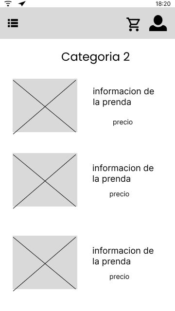
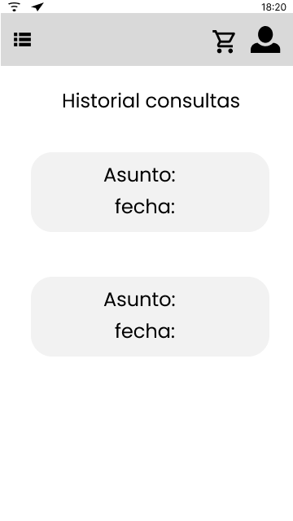
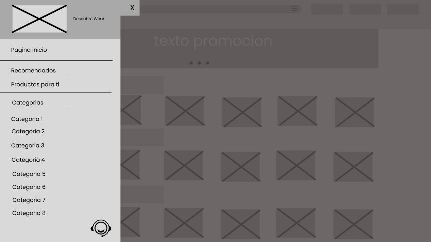
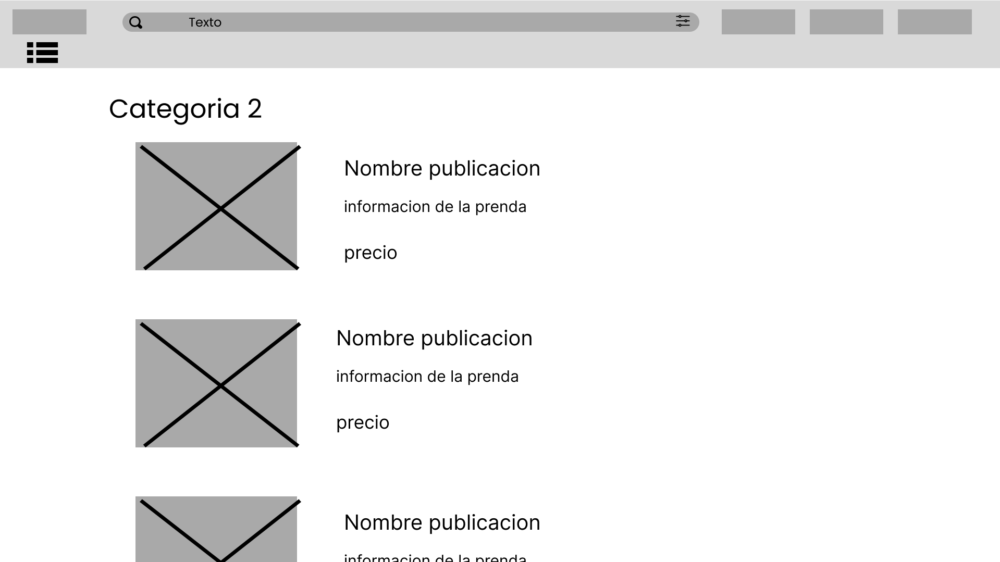

<h1 style="text-align: center;"> Informe del Trabajo Final </h1>
<h3 style="text-align: center;"> Universidad Peruana de Ciencias Aplicadas </h3>


<h5 style="text-align: center"> Ingeniería de Software </h5>

<h5 style="text-align: center"> Desarrollo de Aplicaciones Open Source - WS51 </h5>

<h5 style="text-align: center"> Docente: Juan Antonio Flores Moroco </h5>

<h5 style="text-align: center"> Startup: ... </h5>

<h5 style="text-align: center"> Producto: Event Wear </h5>

## Team members:
| Nombre |Código|
|:-------:|:----------:|
|Castillo Castillo, Alexander Jair|U202211390|
|More Rondon, Christopher Sebastian|U202212199|
|Cortez Quezada, Joaquin Antonio|U202212648|
|Ramos Najar, Tony Alenxander|U20211A153|
|Cruz Palomino, Adriano Sebastian|U202210697|


<h5 style="text-align: center"> Ciclo 2024-01 </h5>

### Registro de Informes

| Versión   | Fecha       | Autor      | Descripción                                                                                      | Estado    |
|-----------|-------------|------------|--------------------------------------------------------------------------------------------------|-----------|
| 1.0       |  10/04/2024| Cruz Palomino, Adriano Sebastian | Creación del documento de trabajo en formato markdown. | Completado  |
| 1.1       |  10/04/2024| Cruz Palomino, Adriano Sebastian | Agrego la parte de User Persona Empathy Map y User Journey Mapping | Completado  |
| 1.2       |  11/04/2024| Ramos Najar, Tony Alenxander | Descripción del startup, Lean UX Canva | Completado  |
| 1.3       |  11/04/2024| Ramos Najar, Tony Alenxander | Analisis de las entrevistas | Completado  |
| 1.4       |  13/04/2024| Castillo Castillo, Alexander Jair | Agrego Web Applications Wireflow Diagrams | Completado  |
| 1.5       |  14/04/2024| Cortez Quezada, Joaquin Antonio | Cambio de Student Outcome  | Completado  |
| 1.6       |  14/04/2024| More Rondon, Christopher Sebastian | Agrego Analisis competitivo  | Completado  |


### Project Report Collaboration Insights

URL del repositorio para el reporte del proyecto: https://github.com/upc-pre-202401-si729-ws51-eventwear

TB1
Para el desarrollo del informe perteneciente a la entrega TB1, se dividió la implementación de secciones de la siguiente forma
para cada integrante del equipo:

| Integrante | Tareas Asignadas |
| --- | --- |
|Alexander Castillo   |Descripción de la Startup, Lean UX Problem Statements, As-is Scenario Mapping, To-Be Scenario Mappingm, Searching Systems, Navigation Systems, Development Evidence for Sprint Review, Testing Suite Evidence for Sprint Review, Software Deployment Evidence for Sprint Review|
|Christopher More  |Análisis competitivo, Estrategias y tácticas frente a competidores, Diseño de entrevistas, Class Diagrams, Class Dictionary, Database Diagram, Team Collaboration Insights during Spring|
|Joaquin Cortez  |Lean UX Assumptions, Lean UX Hypothesis Statements, Lean UX Canvas, Segmentos objetivo, User Stories, Landing Page Wireframe, Landing Page Mock-up, Software Architecture Context Diagram, Software Architecture Components Diagrams|
|Tony Ramos    |User Task Matrix, Impact Mapping, General Style Guidelines, Web Style Guidelines, Organization Systems, Software Architecture Container Diagrams, Services Documentation Evidence for Sprint Review|
|Adriano Cruz    |User Personas, User Journey Mapping, Empathy Mapping, Product Backlog, Labeling Systems, SEO Tags and Meta Tags, Software Development Environment Configuration, Source Code Management, Sprint Planning 1, Sprint Backlog 1, Execution Evidence for Sprint Review|

### Studen Outcome

| **Criterio específico** | **Acciones realizadas** | **Conclusiones** |
| --- | --- | --- |
| Comunica oralmente sus ideas y/o resultados con objetividad a público de diferentes especialidades y niveles jerárquicos, en el marco del desarrollo de un proyecto en ingeniería. | Christopher Sebastian More Rondon:<br><br>TB1: Para esta entrega me encargue de hallar a nuestros posibles competidores, así como analizar sus puntos fuertes y débiles. También comuniqué durante la exposición cuales son nuestros segmentos objetivos y los requisitos que nuestra aplicación debe cumplir para satisfacer sus necesidades<br><br>Joaquin Antonio Cortez Quezada<br><br>TB1: Para esta entrega se investigó sobre los principios de diseño para la página web para el diseño de los mock ups, considerando las users stories y las funcionalidades core del startup<br><br>Tony Alexander Ramos Najar<br><br>TB1: Para esta  entrega me encargué de la formulación del Ubiquitous Language, es fundamental para que nuestro consumidores y nuestra aplicación puedan entenderse, además de implementar el impact Mapping, considerando el user story respectivo posteriormente a mi entrevista realizada <br><br>Adriano Sebastian Cruz Palomino<br><br>TB1: En esta entrega, identifiqué las necesidades de los usuarios y compartí estos hallazgos con mis compañeros. Así, pudimos discutir y colaborar eficazmente dentro del equipo del proyecto.<br><br>Alexander Jair Castillo Castillo<br><br>TB1:  <br>para esta entrega identifiqué el problema que solucionaremos, el principal segmento objetivo en el que nos enfocaremos. Así mismo, planteé algunas hipótesis, riesgos y soluciones respecto al desarrollo de esta. Tomé desiciones de diseño para la landing page. |  Para esta entrega, el equipo realizó una serie de actividades fundamentales para el desarrollo del proyecto. Se investigaron competidores y se analizaron sus puntos fuertes y débiles, se diseñaron mock ups teniendo en cuenta las user stories y funcionalidades esenciales, se formuló un Ubiquitous Language y se aplicó Impact Mapping para facilitar la comunicación y comprensión del proyecto. Además, se identificaron las necesidades de los usuarios y se compartieron estos hallazgos para promover la colaboración efectiva. Se tomaron decisiones respecto a la resolución de problemas, riesgos y soluciones, así como decisiones de diseño para la landing page.   |
| Comunica en forma escrita ideas y/o resultados con objetividad a público de diferentes especialidades y niveles jerárquicos, en el marco del desarrollo de un proyecto en ingeniería. | Christopher Sebastian More Rondon:<br><br>TB1: En el documento rellené el cuadro de competidores, mostrando sus puntos débiles y fuertes al igual que los nuestros. También me encargué de describir las herramientas utilizadas.<br><br>Joaquin Antonio Cortez Quezada<br><br>TB1: Considerando las funcionalidades principales de nuestro proyecto, diseñe los wireframes, mockups y landing page. En cada uno se considero los principios de diseño. Asimismo, siguiendo el modelo ágil, redacte el ux canva y las user stories. <br><br>Tony Alexander Ramos Najar<br><br>TB1: En el presente documento, implementé la sección colaboración en la Landing Page, principalmente para aquellos que deseen trabajar con nosotros y formar una alianza en el mercado, además de realizar la modificación del documento al formato MarkDown. <br><br>Adriano Sebastian Cruz Palomino<br><br>TB1: En este informe, he realizado un análisis profundo de las necesidades de nuestros usuarios. Además, he desarrollado empathy map y el user journey map, herramientas que me han permitido comprender de manera más efectiva las experiencias y expectativas de nuestros usuarios.<br><br>Alexander Jair Castillo Castillo<br><br>TB1:  <br>Al identificar distintos aspectos base de nuestra start up tomé en cuenta las necesidades y limitaciones de nuestros usuarios, tanto para el lean ux canva como para la interfaz de la landing page. |  En esta entrega, cada miembro del equipo desempeñó roles específicos y contribuyó con aspectos clave para el desarrollo del proyecto. Se realizó una investigación exhaustiva de los competidores, destacando sus puntos fuertes y débiles, así como la descripción de las herramientas utilizadas. Se diseñaron wireframes, mockups y una landing page teniendo en cuenta las funcionalidades principales del proyecto y los principios de diseño, además de redactar el UX Canva y las user stories siguiendo el modelo ágil. Se implementó una sección de colaboración en la Landing Page para establecer alianzas en el mercado y se modificó el documento al formato Markdown para una mejor organización.   |

## Contenido

1. **Capítulo I: Introducción.**
    1. Startup Profile.
        1. Descripción del startup.
        2. Perfiles de los integrantes del equipo.
    2. Solution Profile.
        1. Antecedentes y Problemática.
        2. Lean UX Process.
            1.Lean UX Problem Statements.
            2.Lean UX Assumptions.
            3.Lean UX Hypothesis Statements.
            4.Lean UX Canvas.
    3. Segmentos objetivo.

2. **Capítulo II: Requirements Elicitation & Analysis.**
    1. Competidores.
        1. Análisis competitivo.
        2. Estrategias y tácticas frente a competidores.
    2. Entrevistas.
        1. Diseño de entrevistas.
        2. Registro de entrevistas.
        3. Análisis de entrevistas.
    3. Needfinding.
        1. User Personas.
        2. User Task Matrix.
        3. User Journey Mapping.
        4. Empathy Mapping.
        5. As-is Scenario Mapping.
        6. Ubiquitous Language.
3. **Capítulo III: Requirements Specification.**
    1. To-Be Scenario Mapping.
    2. User Stories.
    3. Impact Mapping.
    4. Product Backlog.
4. **Capítulo IV: Product Design.**
    1. Style Guidelines.
        1. General Style Guidelines.
        2. Web Style Guidelines.
    2. Information Architecture.
        1. Organization Systems.
        2. Labeling Systems.
        3. SEO Tags and Meta Tags
        4. Searching Systems.
        5. Navigation Systems.
    3. Landing Page UI Design.
        1. Landing Page Wireframe.
        2. Landing Page Mock-up.
    4. Web Applications UX/UI Design.
        1. Web Applications Wireframes.
        2. Web Applications Wireflow Diagrams.
        3. Web Applications Mock-ups.
        4. Web Applications User Flow Diagrams.
    5. Web Applications Prototyping.
    6. Domain-Driven Software Architecture.
        1. Software Architecture Context Diagram.
        2. Software Architecture Container Diagrams.
        3. Software Architecture Components Diagrams.
    7. Software Object-Oriented Design.
        1. Class Diagrams.
        2. Class Dictionary.
    8. Database Design.
        1. Database Diagram.
5. **Capítulo V: Product Implementation, Validation & Deployment.**
    1. Software Configuration Management.
        1. Software Development Environment Configuration.
        2. Source Code Management.
        3. Source Code Style Guide & Conventions.
        4. Software Deployment Configuration.
    2. Landing Page, Services & Applications Implementation.
        1. Sprint 1
            1. Sprint Planning 1.
            2. Sprint Backlog 1.
            3. Development Evidence for Sprint Review.
            4. Testing Suite Evidence for Sprint Review.
            5. Execution Evidence for Sprint Review.
            6. Services Documentation Evidence for Sprint Review.
            7. Software Deployment Evidence for Sprint Review.
            8. Team Collaboration Insights during Sprint.
6. **Conclusiones.**
7. **Bibliografía.**
8. **Anexos.**

## Capítulo I: Introducción.

### 1. **Startup Profile.**
####     1.1.   Descripción del startup

"Event Wear" es una plataforma innovadora que revoluciona la forma en que las personas se visten para eventos especiales al ofrecer una alternativa sostenible al fast fashion. Conectando a usuarios que desean lucir       prendas únicas y de calidad con aquellos que tienen piezas para alquilar, Event Wear promueve la reutilización y el intercambio, reduciendo así el desperdicio de moda.

Nuestro propósito es empoderar a los usuarios para que disfruten de la moda de manera consciente, fomentando la comunidad, la creatividad y la responsabilidad social a través de la moda sostenible. Event Wear no solo ofrece una solución práctica y elegante para eventos especiales, sino que también contribuye positivamente al medio ambiente y a la sociedad al cambiar la forma en que consumimos moda.

####     1.2. Perfiles de los integrantes del equipo

| Nombre                           | Descripción                                                                                                                                   |
|----------------------------------|-----------------------------------------------------------------------------------------------------------------------------------------------|
| Christopher Sebastian More Rondon (U202212199) | Me llamo Christopher More, soy estudiante de quinto ciclo de Ingeniería de Software. Soy creativo e ingenioso para resolver problemas creando programas. Siempre intento completar las tareas a tiempo y asegurarme de que se encuentren bien hechas |
| Adriano Sebastian Cruz Palomino (U202210697)   | Mi nombre es Adriano Sebastian Cruz Palomino, tengo 19 años, soy alumno de Ingeniería de Software en la UPC, actualmente estoy cursando el 5to ciclo. Soy una persona curiosa, responsable, y comprometida con mis estudios, siempre busco aprender más y mejorar mis habilidades.                              |
| Jair Castillo (U202211390)                     | Mi nombre es Jair Castillo, estoy cursando el 5to ciclo de la carrera de Ingeniería de Software en la UPC.Poseo habilidades intermedias en el lenguaje de programación C++. Soy una persona atenta y responsable, con capacidad para adaptarme de manera efectiva a diversos escenarios y desafíos que puedan surgir.          |
| Tony Alexander Ramos Najar (u20211a153)        | Mi nombre es Tony Ramos, estoy cursando el 7mo ciclo de la carrera de Ingeniería de Software. Me considero hábil en el ámbito de la programación en los lenguajes, Python, Javascript, y últimamente estoy aprendiendo Angular. Con respeto a mi, me considero una persona responsable, con ganas de aprender y a superarme a mi mismo. |
| Joaquin Antonio Cortez Quezada (u202212648)  .jpeg)      | Mi nombre es Joaquín Antonio Cortez Quezada, tengo 19 años y actualmente estoy  cursando el 5to ciclo de la carrera de Ingeniería de Software en la UPC (Universidad Peruana de Ciencias Aplicadas). Me considero una persona perseverante, responsable, empática en cualquier ámbito de mi vida, ya sea en el aspecto académico. |


### 2. **Solution Profile.**

## - What (Qué):
La relación del problema con las personas radica en la presión social y cultural para lucir nuevas prendas en eventos especiales. Muchas personas se sienten obligadas a comprar ropa nueva para cada ocasión, lo que contribuye al ciclo de consumo insostenible del fast fashion y al desperdicio de recursos naturales. Esta dinámica genera tanto una carga económica para los individuos como un impacto ambiental negativo debido a la producción excesiva de prendas y el descarte rápido de las mismas.

## - When (Cuándo):
El problema surge de manera recurrente durante todo el año, con mayor intensidad en períodos que coinciden con temporadas de eventos especiales como bodas, graduaciones, galas y festivales. En estos momentos, la presión para encontrar y lucir nuevas prendas aumenta, lo que impulsa a las personas a recurrir al consumo de moda rápida y contribuye al problema de desperdicio textil y contaminación ambiental.

## -Where (Dónde):
El cliente está presente en una variedad de ubicaciones cuando utiliza el producto. Esto puede incluir su hogar mientras se prepara para un evento especial, en tiendas físicas o en línea buscando prendas para alquilar, así como en el evento mismo donde lucirá la prenda alquilada. Además, el cliente puede encontrarse en entornos sociales, como reuniones familiares, bodas, fiestas o galas, donde la presión para lucir bien y estar a la moda es especialmente relevante. La flexibilidad de la plataforma permite que los clientes accedan al servicio desde cualquier lugar con conexión a internet, lo que amplía su alcance y conveniencia.

## -Who (Quién):
Quienes están involucrados en este contexto son diversos. Por un lado, están los usuarios que desean alquilar prendas para eventos especiales, que pueden ser personas de diferentes grupos demográficos y contextos sociales, desde jóvenes que asisten a bailes de graduación hasta adultos que participan en eventos de gala. Además, están los arrendadores, que son aquellos que ponen a disposición sus prendas para alquilar. Estos pueden ser tanto individuos particulares que buscan sacar provecho de prendas que ya no utilizan como también pueden ser pequeñas empresas o tiendas de moda que deseen diversificar sus ingresos. Ambos grupos de personas, tanto arrendatarios como arrendadores, forman parte del ecosistema de la plataforma, contribuyendo a su funcionamiento y éxito.

## -Why (Por qué):
La causa principal del problema radica en la cultura de consumo impulsada por la industria del fast fashion. Esta industria promueve un modelo de negocio basado en la producción masiva de prendas de vestir a bajo costo y de tendencia rápida, lo que incita a los consumidores a comprar constantemente nuevas prendas para eventos especiales en lugar de reutilizar o alquilar. La presión social y cultural para lucir siempre a la última moda en eventos especiales refuerza este ciclo de consumo desmedido, exacerbando el problema del desperdicio textil y contribuyendo al deterioro del medio ambiente. En resumen, la causa fundamental del problema es la combinación de la producción excesiva de prendas y la mentalidad de usar y desechar promovida por la industria del fast fashion.

## - How (Cómo):

### 1. ¿En qué condiciones los clientes usan nuestro producto?
   Los clientes usarán nuestro producto en condiciones diversas, pero principalmente en eventos especiales como bodas, graduaciones, galas u otras ocasiones formales. Las prendas alquiladas deberán estar en condiciones óptimas para su uso, limpias y en buen estado. Además, es importante que las prendas se ajusten adecuadamente a las necesidades y preferencias del cliente.

### 2. ¿Cómo nos conocieron los compradores?
   Los compradores pueden conocernos a través de una variedad de canales de marketing y promoción. Esto puede incluir publicidad en línea, campañas en redes sociales, recomendaciones de boca en boca, colaboraciones con influencers de moda, presencia en eventos y ferias locales, así como estrategias de SEO y marketing de contenido. La visibilidad y reputación de la plataforma se construirán en base a la calidad del servicio, la variedad de prendas disponibles y la satisfacción del cliente.

### 3. ¿Cómo prefieren los lectores acceder a nuestro contenido?
   Los clientes preferirán acceder al contenido de nuestra plataforma a través de una experiencia en línea intuitiva y fácil de usar. Esto implica tener un sitio web bien diseñado y optimizado para dispositivos móviles, donde los usuarios puedan navegar por el catálogo de prendas, leer reseñas y valoraciones, realizar reservas y pagos de manera segura, y comunicarse con el equipo de soporte si es necesario. La disponibilidad de una aplicación móvil también puede ser una opción conveniente para algunos usuarios.

### 4. ¿Qué llevó a la persona a esta situación?
   Las personas se encuentran en esta situación debido a la presión social y cultural para lucir bien en eventos especiales, así como a la influencia de la industria del fast fashion que promueve un consumo desmedido de prendas de vestir. Además, factores individuales como el deseo de variedad en el guardarropa, la falta de conciencia sobre los impactos ambientales del fast fashion y la conveniencia de comprar en lugar de alquilar también pueden haber contribuido a esta situación.

## - How much (Cuánto):
   La disposición de los clientes a pagar por el servicio dependerá de varios factores, como la exclusividad y la calidad de las prendas ofrecidas, la duración del alquiler, la marca y el prestigio de la plataforma, así como la percepción de valor y conveniencia. Es probable que los clientes estén dispuestos a pagar un precio razonable que refleje la calidad y la conveniencia del servicio, pero también valorarán la accesibilidad y la rentabilidad en comparación con la compra de prendas nuevas. Se requerirán investigaciones de mercado y pruebas de precios para determinar el punto óptimo que maximice los ingresos mientras se mantiene atractiva la propuesta de valor para los clientes.


####     2.1. Antecedentes y Problemática

## Antecedente:
El ascenso del fast fashion ha transformado la industria de la moda, ofreciendo prendas de bajo costo y alta rotación. Esta cultura de consumo efímero ha llevado a una acumulación desmesurada de ropa, especialmente para eventos especiales, exacerbando el problema del desperdicio textil y su impacto ambiental y social negativo.

## Problemática:
La presión social por lucir siempre a la moda en eventos especiales ha creado un ciclo insostenible de compra y descarte de prendas. Esto no solo genera una carga financiera para los individuos, sino que también contribuye al problema ambiental, con toneladas de ropa terminando en los vertederos cada año. Además, el modelo de negocio del fast fashion a menudo está vinculado a prácticas laborales injustas, exacerbando aún más la problemática. En resumen, el consumo desmedido en eventos especiales afecta tanto a las personas como al planeta, perpetuando la injusticia social y el deterioro ambiental.


####     2.2. Lean UX Process
#####         **2.2.1.Lean UX Problem Statements.**

Los usuarios se enfrentan a una presión social y cultural para lucir nuevas prendas en eventos especiales, lo que ha creado un ciclo de compra y descarte insostenible. Esta dinámica impone una carga financiera a los individuos y contribuye al problema del desperdicio textil y la contaminación ambiental.

Nuestra plataforma busca ofrecer una solución sostenible y rentable al problema del consumo desmedido en eventos especiales al facilitar el alquiler de prendas. Promovemos la reutilización, la conveniencia y la conciencia ambiental, mientras creamos una comunidad comprometida con la moda sostenible. En resumen, buscamos transformar la forma en que las personas se visten para eventos especiales, promoviendo un enfoque más consciente y colaborativo hacia la moda.


#####         **2.2.2.Lean UX Assumptions.**

######  Business Assumptions:

- Existe una demanda en el mercado de soluciones tecnológicas que faciliten el alquiler de prendas y accesorios de moda.
- Los consumidores muestran disposición para alquilar prendas y accesorios en lugar de adquirirlos de forma definitiva.
- Los usuarios priorizan la sostenibilidad y la reducción del desperdicio en la industria de la moda al considerar opciones de alquiler.
- Los usuarios buscan disponer de opciones de vestimenta específicas adecuadas para eventos y ocasiones especiales.
- Los propietarios de prendas y accesorios están dispuestos a ofrecer sus artículos en alquiler a través de la plataforma.
- Los usuarios valoran la comodidad y la variedad al seleccionar prendas y accesorios en la plataforma.
- La facilidad de navegación y un diseño intuitivo en la aplicación son aspectos fundamentales para su adopción por parte de los usuarios.
- La retroalimentación y los comentarios de los usuarios son considerados valiosos para mejorar continuamente la experiencia de la plataforma.
- La promoción y la visibilidad en redes sociales y eventos de moda juegan un papel crucial en la captación de usuarios.

###### Business Outcomes:

- Reducción del exceso en la industria de la moda.
- Impulso de la sostenibilidad.
- Acceso ampliado a prendas de calidad.
- Experiencia personalizada.
- Generación de ingresos para propietarios.
- Promoción de la moda sostenible.

###### User Assumptions:

- Los consumidores muestran interés en adoptar prácticas de moda más sostenibles.
- Existe disposición por parte de los usuarios a alquilar prendas y accesorios en lugar de comprarlos.
- La demanda de opciones de moda específicas para eventos es alta entre los usuarios.
- Los propietarios de prendas y accesorios ven el alquiler como una oportunidad.
- Los usuarios buscan una plataforma intuitiva y conveniente para el alquiler de moda.

###### User:

- Consumidor casual de moda.
- Propietarios de prendas y accesorios.
- Asistente a eventos consciente de la moda.

###### User Benefits:

- Consumidores conscientes de la moda.
- Propietarios de prendas y accesorios.
- Asistentes a eventos.

###### Feature Assumptions:

- Interfaz Intuitiva y Accesible.
- Catálogo Variado y Actualizado.
- Proceso de Alquiler Simple y Rápido.
- Notificaciones y Recordatorios Efectivos.
- Descripciones Detalladas y Calidad Visual.
- Proceso de Devolución sin Complicaciones.
- Comentarios y Valoraciones de Usuarios.
- Seguridad en los Pagos y Datos.
- Soporte al Cliente Eficaz

#####         **2.2.3.Lean UX Hypothesis Statements.**

##### Hypothesis Statement 1:
Creemos que, sí ofrecemos una página intuitiva y de fácil manejo a los usuarios que les interesa alquilar prendas y accesorios para eventos específicos, incrementaremos la satisfacción del cliente.
Sabremos que tendremos éxito al observar un aumento del 20% de los usuarios activos después de 4 semanas de su lanzamiento y recibimos comentarios positivos sobre su fácil uso.

##### Hypothesis Statement 2:
Creemos que, así ofrecemos una variedad de prendas de alquiler con un precio competitivo en comparación con la compra de ropa para eventos especiales, motivamos a los usuarios a alquilar una prenda en nuestra plataforma
Sabremos que tendremos éxito al observar un aumento del 10% de nuevos usuarios que prueban la aplicación y alquilan cualquier tipo de prenda en los primeros 3 meses, lo que indica que presentamos una propuesta con valor para el usuario

##### Hypothesis Statement 3:
Creemos que, si implementamos recomendaciones de prendas según los gusto de los usuarios, estos podrán encontrar nuevas prendas que podrían ser de su interés sin tener que hacer una búsqueda exhaustiva por los filtros de búsqueda de la plataforma.
Sabremos que tendremos éxito al observar un aumento del 30% en el uso de recomendación personalidades por parte de todos los usuarios que utilizan la aplicación en un lapso de 6 meses después de estar disponible esta opción 

##### Hypothesis Statement 4:
Creemos que si colaboramos con tiendas locales de moda para ampliar nuestra oferta de prendas y accesorios disponibles para alquilar, aumentaremos la diversidad y atractivo de nuestro catálogo, lo que incentivará a más usuarios a utilizar nuestra plataforma. 
Sabremos que hemos tenido éxito cuando observamos un aumento del 30% en la cantidad de prendas y accesorios disponibles en nuestra plataforma a través de asociaciones con tiendas locales.


#####         **2.2.4.Lean UX Canvas.**

| Lean UX Canvas | Título: EventWear | Fecha: 28/03/24 |
|---------------------|----------------------|--------------|
|Business Problems <br><br><br> - La experiencia frustrante y poco sostenible en la industria de la moda, la cual es provocada por gastos excesivos y grandes acumulaciones de ropa al momento de realizar la compra de un producto de vestimenta para un evento especial | Solution Ideas <br><br><br>  - Desarrollar una aplicación web intuitiva y fácil de usar que permita a los usuarios alquilar prendas, accesorios y calzado para eventos específicos.<br> - Crear un catálogo diverso y actualizado de prendas y accesorios de moda que se adapten a diferentes estilos y ocasiones.<br> - Implementar una función de recomendación personalizada basada en las preferencias y ocasiones de los usuarios.<br>- Ofrecer opciones de alquiler a corto y largo plazo para satisfacer diferentes necesidades de eventos | Business Outcomes <br><br><br> - Aumento de la eficiencia en la organización de eventos y la gestión de vestimenta. <br> - Mejora de la satisfacción del cliente al ofrecer una solución sostenible y asequible.<br> - Generación de ingresos a través de las tarifas de alquiler y posibles planes de suscripción.<br> - Posibilidad de colaboraciones y asociaciones con marcas de moda locales.
| User & Customers <br><br><br> - Usuarios: Personas que asisten a eventos y desean alquilar prendas y accesorios para ocasiones específicas.<br>  - Clientes: Individuos que realizan alquileres a través de la plataforma | | User Benefits <br><br><br>- Permitir a los clientes ahorrar tiempo al momento de comprar un producto adecuado a su gusto.<br> - Evitar que el cliente se vea obligado a visitar diferentes tiendas para encontrar un producto.
| Hypothesis<br><br><br> - Creemos que sí ofrecemos una variedad diversa y actualizada de prendas y accesorios de moda en nuestra plataforma, aumentaremos la satisfacción del cliente y la probabilidad de alquileres repetidos.<br> - Creemos que al colaborar con marcas sostenibles y locales, podremos ampliar nuestra oferta de productos y atraer a un público más amplio y consciente de la sostenibilidad.| What's the most important thing we need to learn first?<br><br><br> - Aprender sobre las opciones de alojamiento web y servidores para asegurarse de que puedan manejar la carga de usuarios y la cantidad de datos necesaria para la plataforma.<br> - Adquirir conocimientos en diseño de UX y UI para crear una interfaz de usuario intuitiva y atractiva que mejore la experiencia de los usuarios al interactuar con la plataforma.<br> - Adquirir habilidades en pruebas y depuración de software para identificar y corregir errores y problemas antes de lanzar la plataforma al público.| What's the least amount of work we need to do to learn the next most important thing?<br><br><br> - Desarrollar prototipos del producto de software para brindar un primer acercamiento de cómo se verá y funcionará el programa.<br> - Realizar un análisis del público objetivo mediante el uso de entrevistas de usuario para conocer sus opiniones y puntos de vista.<br> - Familiarizarse con los lenguajes, frameworks y entre otras herramientas de programación que puedan ser vitales para el desarrollo del producto.|

### 3. **Segmentos objetivo.**

Nuestro segmento objetivo lo conforman las personas las cuales asisten con mayor o menor frecuencia diferentes eventos especiales y buscan una manera rentable y sostenible de obtener la prenda o accesorias que necesitan.
 #### Segmento 1: Consumidor casual de moda:
##### Aspectos demográficos:
• Sexo: masculino y femenino
• Edades: jóvenes adultos entre 18 - 25 años
##### Aspectos geográficos:
• Nacionalidad: Peruana
• Zona geográfica en la que vive: Urbana
• Departamento: Lima Metropolitana
##### Aspectos psicográficos:
• Abiertos a alquilar prendar o accesorios los cuales utilizarían para ocasiones puntuales
No asisten con frecuencia a muchos eventos, pero cuando lo hacen, desean lucir impecable
• Esperan encontrar prendas de buena calidad cuando buscan comprar o alquilar un nuevo vestuario
Están conscientes del impacto ambiental de la moda.

#### Segmento 2: Asistente a eventos :
##### Aspectos demográficos:
• Sexo: masculino y femenino
• Edades: adultos entre 25 - 45 años
##### Aspectos geográficos:
• Nacionalidad: Peruana
• Zona geográfica en la que vive: Urbana
• Departamento: Lima Metropolitana
##### Aspectos psicográficos:
 • Disfrutan de asistir a una variedad de eventos sociales y especiales, como fiestas, bodas, cenas formales, eventos de negocios, etc.
• Tienen un estilo de vida activo y socialmente comprometido, lo que los lleva a requerir una variedad de prendas.
• Valoran la comodidad y la conveniencia, buscando soluciones prácticas y rentables para satisfacer sus necesidades de vestuario.
• Están conscientes del impacto ambiental de la moda.


## Capítulo II: Requirements Elicitation & Analysis

### 1. **Competidores.**
####     1.1. Análisis competitivo.

##### OSZADA: Negocio de alquiler de vestidos, en el que también es posible poner en alquiler un vestido tuyo, a cambio de una ganancia monetaria por el alquiler de este
[OSZADA](https://oszadaboutique.com/)

##### Ecodicta: Es un servicio de alquiler: “Ecodicta night out”. Puedes alquilar trajes durante seis días para llevarlos a eventos, y devolverlo mostrando una etiqueta prepagada
[Ecodicta](https://ecodicta.com/ecodicta-night-out/)

##### Rent the Runaway: Plataforma usada para rentar ropa de diseñador, la cual permite obtener suscripciones a distintos precios para poder rentar items y mantenerlos por el tiempo deseado.
[Rent the Runaway](https://www.renttherunway.com/)

### Análisis de Competencia

##### ¿Por qué llevar a cabo este análisis?
Este análisis se llevará a cabo para tener una idea de qué clase de tácticas usa la competencia, así como tener en claro sus puntos fuertes y débiles. Todo esto con el objetivo de diseñar una estrategia que ayude a nuestra marca a sobresalir.

##### Comparativa con Competidores

|               | EventWear                                                    | OSZADA                                                             | Ecodicta night out                                                                 | Rent the Runaway                                               |
|---------------|--------------------------------------------------------------|--------------------------------------------------------------------|--------------------------------------------------------------------------------------|-----------------------------------------------------------------|
| **Perfil**    |                                                              |                                                                    |                                                                                      |                                                                 |
| **Overview**  | Plataforma de alquiler de ropa. Usuarios pueden publicar información sobre una ropa que deseen poner en alquiler, así como también pueden buscar en el catálogo ropa disponible, ya sea vestidos, trajes, accesorios o calzado | Plataforma para alquilar vestidos, los cuales son puestos en alquiler por otras mujeres, así ayudando a reducir el impacto de la industria de la moda al medioambiente | Servicio para alquilar un conjunto durante seis días, en la fecha que el usuario elija, con servicio de lavandería incluido                                   | Servicio de renta de ropa que permite hacer uso de suscripciones mensuales para alquilar ropa de distintos tipos por el tiempo deseado |
| **Ventaja competitiva** ¿Qué valor ofrece a los clientes? |   Los usuarios pueden acceder a una amplia variedad de ropas. Permitiendo al servicio ser útil en toda ocasión   |  Las usuarias pueden poner en alquiler su propia ropa, además de recibir ingresos del 25% cada vez que sus vestidos sean alquilados  |  Los clientes pueden elegir distintos tipos de ropa para alquilar por seis días, para usarla como deseen antes de decolverla | Otorga opciones de suscripción, las cuales les permiten acceder a una cantidad de ítems que pueden llevar de manera gratis a cada mientras tengan la suscripción activa   |  |
| **Perfil de Marketing** |                                                              |                                                                    |                                                                                      |                                                                 |
| **Mercado objetivo** | Personas que necesitan conseguir de manera rápida y barata ropa para asistir a un evento | Mujeres que necesitan obtener un vestido para asistir a un evento, o que desean ganar dinero con ropa que utilizan poco                         | Mujeres en busca de algún nuevo look para salir a un evento o a pasear durante una semana                                                      | Personas que deseen probar distintos tipos de ropa y tener una amplia libertad para elegir cuánto tiempo tenerla          |
| **Estrategias de Marketing** | Colaboraciones con marcas de moda sostenible y diseñadores | Mostrar la variedad de vestidos que poseen                                                                                        | Mostrar los distintos tipos de ropas que se pueden alquilar, además de incentivar el cuidado del planeta                                             | Contactos con diseñadores reconocidos, y un generoso plan de suscripción  |
| **Perfil de Producto** |                                                              |                                                                    |                                                                                      |                                                                 |
| **Productos y Servicios** | Servicio de alquiler de ropa | Alquiler de vestidos | Alquiler de ropa | Alquiler de ropa |
| **Precios y Costos** | Precio variable según el usuario que coloca la ropa en alquiler | Los precios se dan según el vestido | Aproximadamente menos de un tercio del precio de venta | Membresías desde 95 dólares al mes |
| **Canales de Distribución** | Página web, cita en su local | Página web | Página web | Página web |
| **Análisis FODA** |                                                              |                                                                    |                                                                                      |                                                                 |
| **Fortalezas** | Amplia variedad de ropa que el usuario puede elegir. Además de sistema para calificar al vendedor | Amplia cantidad de vestidos y variedad en ellos | Variedad de ropa y tallas que se pueden alquilar | Oportunidad de cambiar el modelo alquilado por otro rápidamente y sin costo |
| **Debilidades** | Los nuevos usuarios sin ventas realizadas podrían dar poca confianza sobre la seguridad del servicio | Centrarse mayormente en solo vestidos para eventos | Hay algunas tallas que tienen poca variedad de ropa disponible | Los precios pueden llegar a ser demasiado caros |
| **Oportunidades** | Amplia cantidad de personas que necesitan ropa formal para un uso rápido | Gran cantidad de mujeres que desean verse bien para un evento, pero no cuentan con el dinero necesario para comprar un vestido | Amplia cantidad de personas que desean probar un nuevo look por un precio no demasiado alto | Personas con buena cantidad de dinero y que desean cambiar constantemente de ropa |
| **Amenazas** | Negocios de alquiler de ropa más conocidos y con mayor prestigio | Negocios que vendan vestidos de buena calidad a un bajo precio | Otros negocios con mayor variedad de ropas | Otros negocios con precios más accesibles |

####     1.2. Estrategias y tácticas frente a competidores.

Buena visibilidad del catálogo: En el catálogo de la página se debe mostrar la amplia variedad de tipos de ropa que el usuario puede alquilar.<br>
Buena división de ganancias: Los arrendatarios deben recibir un buen margen de ganancias, para incentivarlos a alquilar su ropa y que podamos tener mayor variedad.<br>
Colaboración con marcas sostenibles: Se añadirá al catálogo vestimenta de marcas de ropa sostenibles, las cuales servirán para hacer notar más nuestro servicio.<br>
Mostrar a nuevos arrendatarios: La página principal tendrá la opción de mostrar la ropa que más recientemente se ha puesto en alquiler.<br>

### 2. **Entrevistas.**
####     2.1. Diseño de entrevistas.

##### Segmento Objetivo 1: Consumidor casual de moda:

###### a.- ¿Cuál es su nombre completo?
###### b.- ¿Qué edad tiene?
###### c-. ¿Donde suele buscar su ropa para eventos sociales?
###### d.- ¿En alguna ocasiones le ha resultado difícil encontrar una prenda específica para algún evento?
###### e.- ¿Cuál es el mayor desafío que usted se encuentra al momento de buscar la vestimenta adecuada para un evento social ?
##### (Preguntas específicas para el segmento:)
###### g.- ¿Con qué frecuencia asistes a eventos sociales que requieren una vestimenta especial?
###### h.-¿Qué tan interesado estás en alquilar una prenda para un evento , consideras que es más sostenible para el medio ambiente? 


##### Segmento Objetivo 2: Asistente a eventos
###### a.- ¿Cuál es su nombre completo?
###### b.- ¿Qué edad tiene?
###### c-. ¿Donde suele buscar su ropa para eventos sociales?
###### d.- ¿En alguna ocasiones le ha resultado difícil encontrar una prenda específica para algún evento?
###### e.- ¿Cual es el mayor desafío que usted se encuentra al momento de buscar la vestimenta adecuada para un evento social ?

##### (Preguntas específicas para el segmento:)
###### ¿Cuánto valoras la moda dentro del estilo de tu vida diaria y en los eventos a los que asistes? 
###### ¿Cómo describirías tu estilo personal y cómo se refleja en las prendas que eliges para las reuniones o fiestas?
###### ¿Cuánto frecuentemente cambia su forma de vestir?


####     2.2. Registro de entrevistas.

#### Entrevista 1:
- **Entrevista segmento 1**
- **Nombre:** Fabrizio Mori
- **Sexo:** Masculino
- **Edad:** 18 años
- **Ubicación:** San Miguel
- **Duración:** 1:40
- **Link:** [Entrevista 1](https://drive.google.com/file/d/1FB1q0pdWf_Nw4sgypsgPR5WjAJ0EdXTH/view?usp=drivesdk)
- **Resumen:** El entrevistado menciona comprar en su mayoría en tiendas grandes, pero que suele tener problemas para encontrar ropa del color que desea y de buena calidad. Además, menciona no asistir a eventos sociales muy frecuentemente, y que solo estaría interesado en alquilar para eventos especiales.

#### Entrevista 2:
- **Entrevista segmento 1**
- **Nombre:** Barbara Quezada
- **Sexo:** Femenino
- **Edad:** 19 años
- **Ubicación:** San Juan de Lurigancho
- **Duración:** 4:25
- **Link:** [Entrevista 2](https://drive.google.com/file/d/1Ht6Esxej6BWppiIna8QscvJgaVyLsYex/view?usp=sharing)
- **Resumen:** En la entrevista, Bárbara Quezada compartió sus experiencias en alquiler de venta, destacando la importancia de la preparación y la confianza en sí misma. Señaló que al enfrentar diversas compras, se brindó la oportunidad de aprender y mejorar sus habilidades de comunicación. Además, expresó su aprecio por las plataformas que ofrecen alquiler de ropas, considerándose útiles para familiarizarse con el proceso de facilitar la búsqueda de ropa.

#### Entrevista 3:
- **Entrevista segmento 1**
- **Nombre:** Nicolas
- **Sexo:** Masculino
- **Edad:** 22
- **Ubicación:** Pueblo Libre
- **Link:**  [Entrevista 3](https://drive.google.com/file/d/1GfU2K-st-6Gy0K17sYU6pfJGwtfkl_bY/view?usp=sharing)
- **Duración:** 2:50
- **Resumen:** Nicolas suele buscar sus prendas en las marcas que ya conoce y ha probado, en pocas ocasión no ha podido encontrar la prenda deseada para un conjunto de vestimenta en específico, en estos casos tuve que cambiar por completo su idea principal de vestimenta. El mundo de la moda y vestimenta es un sector que le gusta bastante y lo sigue desde hace algunos años, considera que tiene un estilo simple y poco extravagante, aparte le gusta mantener su forma de vestir, la cual no ha cambiado en su totalidad hace más de diez años.

  
#### Entrevista 4:
- **Entrevista segmento 2**
- **Nombre:** Diego
- **Sexo:** Masculino
- **Edad:** 21
- **Ubicación:** San Martin de Porres
- **Link:** [Entrevista_4](https://drive.google.com/file/d/1uICts9eN3u54qhFvYnL4gfSg4NDyBg10/view?usp=sharing)
- **Duración:** 
- **Resumen:** Diego, un estudiante activo en la escena social, enfrenta retos al buscar ropa que no solo se ajuste a su color preferido y a sus proporciones, sino que también se adapte a los diferentes estilos requeridos por cada contexto social en el que participa. Esta búsqueda de versatilidad y ajuste personalizado lo lleva a explorar diversas tiendas en centros comerciales, aunque admite que no siempre encuentra lo que necesita. Además, Diego menciona que su elección de vestimenta varía significativamente según la ocasión, desde atuendos formales para galas hasta ropa más casual para encuentros informales con amigos.


#### Entrevista 5:
- **Entrevista segmento 2**
- **Nombre:** Sandy
- **Sexo:** Femenino
- **Edad:** 25
- **Ubicación:** Ate Vitarte
- **Link:** [Entrevista_5](https://youtu.be/QXD-cuAbJRE)
- **Duración:** 3:15
- **Resumen:**
La gerente de marketing de diseño nos comenta que esta al tanto de la moda y que ella siempre buscar vestir elegante y a acorde con la moda actual, tambien nos da entender que está dispuesta a probar moda que conlleve un menor impacto con el ambiente. Considera que la moda es un estilo de vida debido a que es nuestro presentar a cada sitio que vayamos

#### Entrevista 6:

- **Segmento 2**
- **Nombre:** Carolina Zegarra
- **Sexo:** Femenino
- **Edad:** 25
- **Ubicación:** San Luis
- **Link:** [Entrevista_5](https://drive.google.com/file/d/1wq0hFeGGGvq6rTnkG6_Uxs5jesMxPB-n/view?usp=sharing)
- **Duración:** 2:00
- **Resumen:**
En la entrevista, Carolina Zegarra compartió sus experiencias en alquiler de venta, destacando la importancia de la preparación y la confianza en sí misma. Señaló que al enfrentar diversas compras, se brindó la oportunidad de aprender y mejorar sus habilidades de comunicación. 


####     2.3. Análisis de entrevistas.

#### Análisis Entrevista 1:

El entrevistado prefiere comprar en tiendas grandes, pero a menudo tiene dificultades para encontrar ropa de buena calidad y del color que desea. No asiste a eventos sociales con frecuencia y solo está interesado en alquilar ropa para ocasiones especiales. Esto sugiere que valora la calidad y el aspecto de su ropa, pero prefiere no invertir en prendas costosas que solo usará ocasionalmente. Por lo tanto, podría beneficiarse de la oferta de prendas de alta calidad de StyleShare y del alquiler de ropa para eventos especiales ofrecido por Change4All.


#### Análisis Entrevista 2:

En la entrevista, Bárbara Quezada mencionó su participación en el alquiler de ropa, resaltando la relevancia de la preparación y la confianza en uno mismo. Destacó que al enfrentarse a diferentes compras, tuvo la oportunidad de adquirir y perfeccionar sus habilidades de comunicación. Asimismo, manifestó su gratitud por las plataformas que proporcionan servicios de alquiler de ropa, ya que las considera beneficiosas para familiarizarse con el proceso y facilitar la búsqueda de prendas.


#### Análisis Entrevista 3:

Nicolas prefiere buscar sus prendas en marcas que ya conoce y ha probado. Aunque rara vez no ha podido encontrar la prenda deseada para un conjunto específico, en esos casos ha tenido que cambiar por completo su idea original de vestimenta. Tiene un gran interés en el mundo de la moda y la vestimenta desde hace años, y considera que su estilo es simple y poco extravagante. Ha mantenido su forma de vestir durante más de diez años sin cambios significativos.

#### Análisis Entrevista 4:

La entrevista con Diego, un estudiante activo en eventos sociales, destaca varios desafíos y oportunidades dentro de la industria de la moda. Primero, revela la dificultad de encontrar ropa que satisfaga gustos específicos en color y ajuste adecuado a las proporciones personales, señalando la necesidad de una mayor personalización en la oferta de moda. Además, su necesidad de adaptar su vestimenta a diferentes contextos sugiere que hay un mercado para prendas más versátiles. Curiosamente, su desconocimiento sobre el impacto del fast fashion resalta una oportunidad educativa significativa para las marcas, que podrían beneficiarse al informar a los consumidores sobre las prácticas sostenibles. Este análisis sugiere que abordar la personalización, la versatilidad y la educación sobre sostenibilidad podría no solo mejorar la satisfacción del consumidor, sino también fomentar prácticas más responsables en la industria.

#### Análisis Entrevista 5:

Sandy, La gerente de marketing de diseño parece tener una perspectiva sofisticada y consciente de la moda. Su interés en vestir elegante y seguir las tendencias actuales sugiere que está bien informada sobre el mundo de la moda. Su disposición a probar moda que tenga un menor impacto ambiental muestra una preocupación por la sostenibilidad, lo cual es cada vez más importante en la industria de la moda. Al considerar la moda como un estilo de vida y una forma de presentarse en diferentes lugares, demuestra una comprensión profunda de cómo la moda puede influir en la percepción de uno mismo y en la forma en que se es percibido por los demás. Esto sugiere que la gerente de marketing de diseño tiene una mentalidad abierta y está dispuesta a adaptarse a nuevas ideas y conceptos en la moda.
Además, su enfoque en la moda como un estilo de vida refleja una conexión emocional con la ropa y cómo esta puede expresar la identidad y la personalidad. Al ver la moda de esta manera, es probable que la gerente de marketing de diseño tenga una sensibilidad especial hacia la estética y la creatividad en su trabajo. Su actitud receptiva hacia la moda sostenible también sugiere que podría estar interesada en promover valores éticos y responsables en la empresa. En resumen, la gerente de marketing de diseño parece ser una líder consciente de la moda, con una visión que va más allá de lo superficial, y que podría ser una fuente valiosa de inspiración y dirección para la empresa en términos de estilo y valores

#### Análisis Entrevista 6:

 Durante la entrevista, Carolina Zegarra compartió su experiencia en el ámbito del alquiler de ropa, haciendo hincapié en la importancia de la preparación personal y la confianza en sí misma. Resaltó que a lo largo de diferentes transacciones de compra, pudo desarrollar y mejorar sus habilidades de comunicación. Además, expresó su agradecimiento por las plataformas que ofrecen servicios de alquiler de prendas, considerando que estas son de gran utilidad para familiarizarse con el proceso y simplificar la búsqueda de vestimenta.  


### 3. **Needfinding.**
####     3.1. User Personas.

Segmento Objetivo 1: Barbara Sanchez 


Segmento Objetivo 2: María Fernández
 


####     3.2. User Task Matrix.


**BARBARA SANCHEZ**
| Actividades                                                                                           | Frecuencia        | Importancia |
|-------------------------------------------------------------------------------------------------------|-------------------|-------------|
| Almacenar archivos o documentos relacionados con sus clases en servicios de almacenamiento en la nube. | Con Frecuencia    | Alta        |
| Trabajar de forma colaborativa en línea al mismo tiempo que sus colegas.                             | Con Frecuencia    | Alta        |
| Organizar sus archivos para lograr una gestión más efectiva.                                          | A veces           | Media       |
| Modificar sus documentos directamente desde el almacenamiento en la nube.                              | A veces           | Media       |
| Acceder a sus archivos almacenados en la nube desde diversos dispositivos.                             | Con Frecuencia    | Alta        |
| Eliminar archivos de manera permanente o temporal.                                                    | Rara vez          | Baja        |


**MARIA FERNANDEZ**
| Actividades                                                                                           | Frecuencia        | Importancia |
|-------------------------------------------------------------------------------------------------------|-------------------|-------------|
| Almacenar archivos o documentos relacionados con sus clases en servicios de almacenamiento en la nube. | A veces           | Media       |
| Trabajar de forma colaborativa en línea al mismo tiempo que sus colegas.                             | Con Frecuencia    | Alta        |
| Organizar sus archivos para lograr una gestión más efectiva.                                          | Con frecuencia    | Alta        |
| Modificar sus documentos directamente desde el almacenamiento en la nube.                              | A veces           | Media       |
| Acceder a sus archivos almacenados en la nube desde diversos dispositivos.                             | Rara Vez          | Baja        |
| Eliminar archivos de manera permanente o temporal.                                                    | Rara vez          | Baja        |


####     3.3. User Journey Mapping.

Segmento Objetivo 1: Barbara Sanchez 


Segmento Objetivo 2: María Fernández


####     3.4. Empathy Mapping.
Segmento Objetivo 1: Barbara Sanchez


Segmento Objetivo 2: María Fernández


####     3.5. As-is Scenario Mapping.

 

####     3.6. Ubiquitous Language.


## Capítulo III: Requirements Specification
### 1. **To-Be Scenario Mapping.**


### 2. **User Stories.**

<br><br>
| User Story ID | US01   |
|---------------|--------|
| Epic ID       | EP01   |
| Título        | Registro de usuario |

### Descripción
Como usuario, quiero registrarme en la aplicación web para acceder a todas sus funcionalidades.

### Criterios de aceptación

#### Escenario 1: Registro de cuenta con Gmail
Dado que el usuario se quiere registrar en la web
Cuando selecciona la opción “Registrarse” en la pantalla de registros
Y ingresa su Gmail personal
Y selecciona la opción “Continuar registro”
Cuando aparece el nuevo apartado de datos ingresa su información personal, como nombre, zona de residencia, número telefónico y contraseña
Entonces la aplicación web registra el usuario y lo redirige a la pantalla principal.<br>


<br><br>
| User Story ID | US02   |
|---------------|--------|
| Epic ID       | EP01   |
| Título        | Verificación de correo electrónico |

### Descripción
Como usuario, quiero recibir un correo electrónico de verificación después de registrarme.

### Criterios de aceptación

#### Escenario 1: Verificación de correo electrónico
Dado que el nuevo usuario se a registrado
Cuando ingreso a su correo electrónico
Y revisa la bandeja de entrada
Entonces encuentra un correo electrónico de verificación con un enlace para confirmar su dirección de correo electrónico


<br><br>
| User Story ID | US03   |
|---------------|--------|
| Epic ID       | EP01   |
| Título        | Inicio de sesión |

### Descripción
Como usuario registrado en la aplicación web quiero iniciar sesión en cualquier dispositivo donde esté disponible la aplicación web para usarla en el momento que desee.  

### Criterios de aceptación

#### Escenario 1: Inicio de sesión con correo
Dado que el usuario quiere iniciar sesión
Cuando ingresa su correo electrónico en la pantalla de inicio de sesión
y ingresa la contraseña
Y selecciona la opción “Continuar”
Entonces la aplicación web lo redirige a la pantalla principal

<br><br>
| User Story ID | US04   |
|---------------|--------|
| Epic ID       | EP01   |
| Título        | Configuración de perfil inicial |

### Descripción 
Como usuario, quiero completar mi perfil inicial para proporcionar información relevante.

### Criterios de aceptación 

#### Escenario 1: Configuración de perfil inicial
Dado que el usuario se encuentra en la pantalla principal
Cuando accede a la pantalla de perfil
Y selecciona Editar
Entonces la aplicación web guía al usuario para completar campos como nombre, apellidos, foto de perfil, y otra información relevante.


<br><br>
| User Story ID | US05   |
|---------------|--------|
| Epic ID       | EP02   |
| Título        | Búsqueda de prendas en la aplicación web |

### Descripción
Como usuario quiero buscar prendas por la app para seleccionar aquellas que se acomoden a mis preferencias.  

### Criterios de aceptación

#### Escenario 1: Ingreso al apartado de prendas de la pantalla principal
Dado que el usuario se encuentro en la pantalla principal de la aplicación web
Cuando se dirige a una categoría que le muestra la pantalla principal
Y da clic al nombre de la categoría
Entonces la aplicación muestra una amplia lista con distintos tipos de prendas
 
#### Escenario 2: Muestra lista de prendas en base a criterios de búsqueda
Dado que el usuario se encuentra en la pantalla principal de la aplicación web
Cuando ingresa palabras clave o filtros de búsqueda en el campo de búsqueda
Y selecciona inicia la búsqueda
Entonces la aplicación web muestra una lista de prendas que coinciden con los criterios de búsqueda del usuario con una pequeña descripción de estos


<br><br>
| User Story ID | US06   |
|---------------|--------|
| Epic ID       | EP02   |
| Título        | Agregar filtros de búsqueda avanzada |

### Descripción
Como usuario quiero tener a mi disposición una serie de filtros para encontrar una prenda de mi interés más rápido. 

### Criterios de aceptación

#### Escenario 1: acceso a filtro avanzado
Dado que el usuario se encuentra en la página principal de la aplicación
Cuando selecciona la opción de filtros avanzados en la barra de búsqueda
Entonces la aplicación muestra opciones adicionales de filtro, como categoría de prenda, talla, material y precio
Cuando completa la información del filtro avanzado con las características que busca
Y inicia la búsqueda
Entonces la aplicación web muestra una lista de prendas que coinciden con los criterios de búsqueda del usuario
 
#### Escenario 2: Ingreso de datos erróneas en el filtro avanzado
Dado que el usuario selecciona el filtro avanzado
Cuando ingresa datos erróneos en los filtros
Y realiza la búsqueda
Entonces la aplicación web muestra un mensaje de alerta donde muestra los datos erróneos que se agregaron en el filtro


<br><br>
| User Story ID | US07   |
|---------------|--------|
| Epic ID       | EP02   |
| Título        | Exploración de prendas recomendadas |

### Descripción
Como usuario quiero que la aplicación me recomiende nuevas prendas relacionadas a mis intereses y gustos.

### Criterios de aceptación

#### Escenario 1: ingresar al apartado de Recomendaciones
Dado que el usuario se encuentra en la página principal de la aplicación
Y selección el menú desplegable
Cuando visualiza al apartado de Productos para ti
Y da clic
Entonces la aplicación web muestra el apartada de Productos para ti
 
#### Escenario 2: realizar búsqueda de Prendas recomendadas
Dado que el usuario se encuentra en el apartado de Productos para ti
Cuando navega por la sección
Entonces la aplicación web muestra una lista de prendas sugeridas basados en los intereses y preferencias del usuario


<br><br>
| User Story ID | US08   |
|---------------|--------|
| Epic ID       | EP03   |
| Título        | Ver detalles de la prenda |

### Descripción
Como usuario, quiero poder ver información detallada sobre la prenda que deseo alquilar para obtener todos los detalles relevantes.

### Criterios de aceptación

#### Escenario 1: ingresar a ver los datos de la prenda
Dado que el usuario se encuentra en la página principal de la aplicación
Cuando abre el menú desplegable
Y selecciona una categoría de su interés
Y selecciona una prenda
Entonces la aplicación muestra una pantalla con información detallada sobre la prenda, como nombre, precio, imágenes, comentarios y una descripción en la cual se menciona el material, proceso de fabricación, talla, estilo.


<br><br>
| User Story ID | US09   |
|---------------|--------|
| Epic ID       | EP03   |
| Título        | Guardar prendas en favoritos |

### Descripción
Como usuario, quiero tener la opción de guardar una prenda en mi lista de favoritos para poder acceder rápidamente a ella en cualquier momento.

### Criterios de aceptación

#### Escenario 1: Añadir prenda a favoritos
Dado que el usuario encontró una prenda de su interés
Cuando selecciona la opción de añadir en lista de favoritos
Entonces la aplicación guarda la prenda en la sección de favoritos para acceder fácilmente más adelante.
 
#### Escenario 2: visualizar prendas marcadas como favoritos
Dado que el usuario he agregado una prenda como favorito
Cuando se dirijo al apartado de mi perfil en la aplicación web
Y da clic en Lista de Favoritos
Entonces la aplicación muestra todas las prendas las cuales se han marcado como favoritos
 
#### Escenario 3: eliminar prenda favoritos
Dado que el usuario quiere eliminar una prenda de favoritos
Cuando se dirige al apartado de perfil en la aplicación web
Y da clic en Lista de Favoritos
Y selecciona la opción eliminar prenda
Entonces la aplicación eliminará de Lista de Favoritos la prenda seleccionada


<br><br>
| User Story ID | US10   |
|---------------|--------|
| Epic ID       | EP04   |
| Título        | Ver sección de alquiler en la aplicación |

### Descripción
Como usuario, quiero poder acceder al alquiler de cualquier prenda en la aplicación.

### Criterios de aceptación

#### Escenario 1: Ingreso al apartado de búsqueda de prendas
Dado que el usuario se encuentra en la página principal de la aplicación
Cuando abre el menú desplegable
Y selecciona una categoría de su interés
Entonces la aplicación web muestra una amplia lista de prendas
 
#### Escenario 2: ingresar a ver los datos de la prenda
Dado que el usuario ve las prendas disponibles en una categoría
Cuando selecciona una prenda específica de su interés.
Entonces la aplicación muestra una pantalla con información detallada sobre la prenda, como nombre, precio, imágenes, comentarios y una descripción en la cual se menciona el material, proceso de fabricación, talla, estilo.
 
#### Escenario 3: Ingresar a la sección alquiler de prenda
Dado que el usuario observa los detalles de una prenda y quiere alquilarla
Cuando selecciono la opción de alquilar ahora
Entonces la aplicación muestra un campo o selector donde puedo seleccionar la cantidad de tiempo que quiere alquilar la prenda


<br><br>
| User Story ID | US11   |
|---------------|--------|
| Epic ID       | EP04   |
| Título        | Realizar Alquiler de prendas |

### Descripción
Como usuario, quiero poder realizar el alquiler de una prenda por un tiempo determinado para tenerla en mi poder.  

### Criterios de aceptación

#### Escenario 1: Selección de una prenda por un número de días no válidos
Dado que el usuario selecciona la cantidad de días que quiere alquilar una prenda
Cuando da clic en el botón seguir con el alquiler
Entonces la aplicación muestra un mensaje emergente donde indica que la prenda no está disponible para ser alquilada la cantidad de días seleccionadas.
 
#### Escenario 2: Mostrar resumen antes de finalizar alquiler
Dado que el usuario selecciona la cantidad días que desea alquilar una prenda
y esta listo para realizar la compra
Cuando selecciona la opción de confirmar alquiler
Entonces la aplicación muestra un resumen del alquiler, incluyendo la prenda, la cantidad de días y el precio total antes de confirmar el alquiler.
 
#### Escenario 3: Finalizar proceso de alquiler
Dado que el usuario verifico la compra visualizando el resumen de compra
Y esta conforme con los datos
Cuando selecciona la opción de confirmar alquiler
Entonces la aplicación procesa la solicitud de alquiler, a la par que registra la transacción


<br><br>
| User Story ID | US12   |
|---------------|--------|
| Epic ID       | EP05   |
| Título        | Crear una nueva publicación |

### Descripción
Como usuario quiero tener la posibilidad de publicar las prendas en buen estado que ya no uso en la aplicación para generar algún tipo de ingreso 

### Criterios de aceptación

#### Escenario 1: Publicación Exitosa
Dado que el usuario publicar una prenda.
Y se encuentra en la pantalla principal
Cuando selecciona "Publicar Prenda".
Entonces, la aplicación muestra un formulario de publicación que incluye campos para agregar imágenes de la prenda, título, descripción, categoría, talla, estado de la prenda y precio de alquiler.
Cuando completa todos los campos requeridos
y da clic en el botón "Publicar".
Entonces, la aplicación muestra un mensaje de confirmación de que la prenda se ha publicado con éxito.
 
#### Escenario 2: Publicación Incompleta
Dado que el usuario quiere publicar una prenda.
Y se encuentra en la pantalla principal
Cuando selecciona "Publicar Prenda".
Entonces la aplicación muestra un formulario de publicación.
Cuando el usuario deja campos obligatorios sin completar
y da clic en el botón "Publicar".
Entonces, la aplicación muestra un mensaje de alerta donde muestra los campos que faltan completar
 
#### Escenario 3: Cancelación de Publicación
Dado que el usuario está en el proceso de crear una nueva publicación.
Cuando completa algunos de los campos del formulario de publicación.
Y decide cancelar la publicación en lugar de finalizar.
Entonces, la aplicación pregunta si estoy seguro de que quiere cancelar
 


<br><br>
| User Story ID | US13   |
|---------------|--------|
| Epic ID       | EP05   |
| Título        | Visualizar todas mis publicaciones |

### Descripción
Como usuario, quiero poder visualizar mis publicaciones para ver su estado y los comentarios interesados en el producto que ofrezco.


### Criterios de aceptación

#### Escenario 1: Visualización Exitosa de Publicaciones
Dado que el usuario publica varias prendas en alquiler.
Cuando accede a la sección mi perfil.
Y selecciona Productos publicados
Entonces, la aplicación muestra una lista ordenada de todas las prendas que ha publicado
 
#### Escenario 2: Acceso a Detalles de Publicación
Dado que el usuario publica varias prendas en alquiler.
y visualiza la lista de sus publicaciones.
Cuando da clic en el elemento de una publicación en la lista.
Entonces, la aplicación lo redirige a una pantalla que muestra información detallada de esa publicación


<br><br>
| User Story ID | US14   |
|---------------|--------|
| Epic ID       | EP06   |
| Título        | Ayuda con problemas en la aplicación |

### Descripción
Como usuario quiero poder ponerme en contacto con servicio al cliente para que me ayuden a resolver cualquier duda o problema que se me presente en la aplicación.

### Criterios de aceptación

#### Escenario 1: Acceder al servicio de soporte al cliente
Dado que el usuario se encuentra navegando por la aplicación web
Y tiene una pregunta o un problema mientras usa la aplicación
Cuando abre el menú desplegable
Y da clic en el icono "Soporte al cliente"
Entonces la aplicación muestra la opción de "Realizar Consulta".
 
#### Escenario 2: Enviar una solicitud de soporte
Dado que el usuario selecciona "Realizar Consulta".
Y completa el apartado Asunto y descripción
Entonces la aplicación le notificara al usuario cuando el equipo de soporte responda su duda
 
#### Escenario 3: Recibir una respuesta del servicio de soporte
Dado que el usuario envía una solicitud de soporte al cliente
Cuando el equipo de soporte recibe la solicitud
Entonces la aplicación iniciaría un chat con un personal especializado para que pueda resolver todas mis dudas


<br><br>
| User Story ID | US15   |
|---------------|--------|
| Epic ID       | EP06   |
| Título        | Asesoramiento sobre moda sostenible |

### Descripción
Como usuario quiero poder tener asesoramiento sobre moda sostenible para saber cómo puedo ayudar al medio ambiente.

### Criterios de aceptación

#### Escenario 1: Acceder a asesoramiento sobre moda sostenible
Dado que el usuario se encuentra navegando por la aplicación web
Y tiene una pregunta o un problema mientras usa la aplicación
Cuando abre el menú desplegable
Y da clic en el icono "Soporte al cliente"
Entonces la aplicación muestra la opción de Saber más sobre moda sostenible
 
#### Escenario 2: Obtener recomendaciones personalizadas
Dado que el usuario se encuentra en el apartado Saber más sobre moda sostenible
Entonces la aplicación web iniciaría un chat en tiempo real con un asesor capacitado sobre el tema

<br><br>
| User Story ID | US16   |
|---------------|--------|
| Epic ID       | EP08   |
| Título        | Recopilación de información |

### Descripción
Como consumidor casual de la moda, quiero encontrar la información precisa para utilizar la aplicación web

### Criterios de aceptación

#### Escenario 1: Acceso al landing page
Dado que el consumidor casual de la moda esta investigando información
Cuando ingreso al landing page de la pagina web
Y se dirige a la sección de consumidor casual de la moda
Entonces el landing page le mostrara los beneficios que el puede otorgar hacer uso de la pagina web


<br><br>
| User Story ID | US17   |
|---------------|--------|
| Epic ID       | EP08   |
| Título        | Beneficios al consumidor |

### Descripción
Como Asistente a eventos consciente de la moda, quiero entender los beneficios que me aportara el uso de la página web

### Criterios de aceptación

#### Escenario 1: Acceso al landing page
Dado que el asistente a eventos consciente de la moda está investigando los beneficios
Cuando ingreso al landing page de la pagina web
Y se dirige a la sección de consumidor casual de la moda
Entonces el landing page le mostrara los beneficios que él puede otorgar hacer uso de la pagina web

<br><br>
| User Story ID | US18   |
|---------------|--------|
| Epic ID       | EP0   |
| Título        | Sección “Segmentos” |

### Descripción
Como Asistente a eventos consciente de la moda, quiero entender los beneficios que me aportará el uso de la página web, para poder elegir con conocimiento las opciones que mejorarán mi experiencia en eventos.

### Criterios de aceptación

#### Escenario 1: Acceso al segmentos

Dado que soy un usuario que accede a la sección "Segmentos" de la página web,
Cuando navego por esta sección,
Entonces debería ver que el diseño visual (incluyendo colores, tipografías y estilos de imágenes) es coherente con el resto de la página web.
Y este diseño debe ser visualmente atractivo y alinearse con las tendencias de moda actuales para apelar a asistentes a eventos de moda.
Y todos los elementos visuales deben cargar correctamente sin errores visuales o técnicos.


<br><br>
| User Story ID | US19   |
|---------------|--------|
| Epic ID       | EP07   |
| Título        | Sección “Nosotros” |

### Descripción
Como visitante interesado en conocer más sobre la empresa, quiero acceder a una sección "Nosotros" clara y bien estructurada para comprender mejor la misión, visión, y valores de la empresa, y así sentir mayor confianza y conexión con la marca.


### Criterios de aceptación

#### Escenario 1: Accesibilidad y Diseño Responsivo
Dado que soy un usuario que visita el sitio web,
Cuando accedo a la sección "Nosotros" desde el menú principal o desde un enlace directo en la página de inicio,
Entonces debo poder visualizar la página sin problemas de carga y con un diseño que se adapte correctamente a la pantalla de mi dispositivo (ya sea móvil, tablet o escritorio).
#### Escenario 2: Contenido Claro y Estructurado con Elementos Interactivos
Dado que estoy explorando la sección "Nosotros" para obtener más información sobre la empresa,
Cuando navego por las subsecciones de historia, misión, visión y valores,
Entonces debo encontrar textos claros y bien organizados, así como elementos interactivos (como un video corporativo o un timeline de hitos importantes) que enriquezcan mi comprensión y experiencia.

<br><br>
| User Story ID | US20  |
|---------------|--------|
| Epic ID       | EP07   |
| Título        | Sección “Header” |

### Descripción
Como usuario del sitio web, quiero que el header sea claro y fácil de navegar, para que pueda encontrar rápidamente la información o sección que busco, lo que me permitirá tener una experiencia de usuario más fluida y satisfactoria.

### Criterios de aceptación

#### Escenario 1: Visualización de elementos esenciales en el header
Dado que estoy navegando en cualquier página del sitio web,
Cuando cargo la página,
Entonces debo ver claramente el logotipo de la empresa, el menú de navegación principal, y enlaces a las redes sociales o opciones de contacto.
Y el logotipo debe estar vinculado a la página de inicio para facilitar el acceso rápido a ella.

#### Escenario 2: Funcionalidad de los enlaces del menú
Dado que deseó navegar a diferentes secciones del sitio a través del header,
Cuando hago clic en cualquiera de los enlaces del menú,
Entonces cada enlace debe llevarme a la sección correspondiente del sitio sin errores.
Y la transición debe ser rápida y sin interrupciones.

<br><br>
| User Story ID | US21   |
|---------------|--------|
| Epic ID       | EP07   |
| Título        |  Sección “Contacto”|

### Descripción
Como usuario que desea obtener más información o resolver dudas específicas, quiero acceder a una sección de contacto clara y fácil de usar, para que pueda comunicarme con la empresa de manera eficiente y sin complicaciones.

### Criterios de aceptación
#### Escenario 1: Formulario de Contacto Funcional
Dado que prefiero enviar un mensaje directo a través del sitio web,
Cuando relleno y envío el formulario de contacto,
Entonces el formulario debe validar los campos requeridos y enviarse correctamente, confirmándome que mi mensaje ha sido recibido con una notificación o mensaje en pantalla.

<br><br>
| User Story ID | US22   |
|---------------|--------|
| Epic ID       | EP07  |
| Título        | Sección “Colaboración” |

### Descripción
Como usuario interesado en colaborar con la organización, deseo encontrar una sección en el sitio web dedicada a la colaboración, para que pueda comprender fácilmente cómo puedo contribuir, cuáles son los beneficios y cómo iniciar el proceso.

### Criterios de aceptación

#### Escenario 1: Contenido Explicativo Completo:
Dado que estoy interesado en las oportunidades de colaboración,
Cuando visite la sección de "Colaboración",
Entonces debería encontrar una descripción clara y completa de los diferentes tipos de colaboración que ofrece la empresa (como asociaciones, contribuciones de contenido, patrocinios, o programas de voluntariado).
#### Escenario 2: Proceso de Solicitud Claro:
Dado que he decidido aplicar para una colaboración,
Cuando desee comenzar el proceso,
Entonces debería encontrar un formulario de solicitud o instrucciones claras sobre cómo enviar mi propuesta de colaboración, incluyendo detalles sobre la información y documentos necesarios.

<br><br>
| User Story ID | US23   |
|---------------|--------|
| Epic ID       | EP07   |
| Título        | Sección “Footer” |

### Descripción
Como usuario del sitio web, quiero que el footer ofrezca accesos directos a información relevante y recursos adicionales para mejorar mi experiencia de navegación y asegurar que encuentro fácilmente lo que necesito.

### Criterios de aceptación

#### Escenario 1: Inclusión de Elementos Esenciales
Dado que busco información esencial al final de la página,
Cuando navego al footer del sitio,
Entonces debo encontrar enlaces a las páginas de "Política de privacidad", "Términos y condiciones", "Contacto", y "Sobre nosotros".

#### Escenario 2: Accesibilidad a Redes Sociales:
Dado que deseo seguir a la empresa en redes sociales,
Cuando miro el footer,
Entonces debería ver íconos de redes sociales que enlacen directamente a los perfiles oficiales de la empresa en estas plataformas.
#### Escenario 3: Navegación Secundaria:
Dado que quiero explorar más contenido sin volver al menú principal,
Cuando busco más opciones de navegación,
Entonces el footer debería incluir enlaces a otras secciones importantes del sitio web como "Productos", "Servicios", "Eventos" y "Blog".

## Epics:

| Epic                           | Descripción                                                                                                     |
|--------------------------------------|-----------------------------------------------------------------------------------------------------------------|
| EP01: Registro y configuración del perfil del usuario | Como usuario, quiero tener un registro y configuración del perfil del usuario.                                |
| EP02: Búsqueda de prendas             | Como usuario, quiero poder buscar la prenda que me interesa.                                                   |
| EP03: Información detallada de prendas | Como usuario, quiero obtener información detallada de la prenda de mi interés.                                 |
| EP04: Alquiler de prendas             | Como usuario, quiero poder realizar el alquiler de una prenda.                                                  |
| EP05: Publicación de prendas          | Como usuario, quiero tener la opción de publicar mis prendas.                                                  |
| EP06: Servicio de soporte al cliente  | Como usuario, quiero acceso a un servicio de soporte al cliente eficaz.                                       |
| EP07: Visita al landing page          | Como usuario, quiero visitar el landing page de la página web.                                                 |


### 3. **Impact Mapping.**

- **¿Por qué llevar a cabo nuestro proyecto?**
  
Porque queremos abordar el problema del fast fashion y el desperdicio de moda, pudiendo ofrecer una opción sostenible que promueva la reutilización de prendas

- **¿Cuál es nuestro público objetivo?**
  
Nuestro público objetivo son personas que buscan prendas únicas y de calidad para diversas ocasiones, así también como aquellos que solo desean adquirir ropa moderna y de moda.

- **¿Cómo nuestro público nos ayuda a conseguir nuestro objetivo?**
  
Nos ayuda al utilizar la plataforma para alquilar y compartir nuevas o prendas que ellos posean, contribuyendo así a reducir el consumo excesivo de moda desperdiciada

- **¿Qué podemos hacer para lograr el impacto deseado en nuestro público?**
  
Podemos promover activamente la plataforma a través de campañas de concienciación sobre la moda sostenible, también podemos colaborar con diseñadores y marcas comprometidas con la sostenibilidad, además de crear una comunidad específica de Event Wear donde compartir ideas

#### 3.3.1 Impact Mapping Design:


### 4. **Product Backlog.**

|**# Orden**|**User Story Id**|**Título**|**Descripción** |**Story Point ( 1 / 2 / 3 / 5 / 8)** |
| :- | :- | :- | :- | :- |
|**1**|**US01**|**Registro de usuario**|Como usuario, quiero registrarme en la aplicación web para acceder a todas sus funcionalidades.|**3**|
|**2**|**US02**|**Verificación de correo electrónico**|Como usuario, quiero recibir un correo electrónico de verificación después de registrarme.|**2**|
|**3**|**US03**|<p>**Inicio de sesión**</p><p></p>|Como usuario registrado en la aplicación web quiero iniciar sesión en cualquier dispositivo donde esté disponible la aplicación web para usarla en el momento que desee.|**3**|
|**4**|**US04**|<p>**Configuración de perfil inicial**</p><p></p>|Como usuario, quiero completar mi perfil inicial para proporcionar información relevante.|**3**|
|**5**|**US05**|<p>**Búsqueda de prendas en la aplicación web**</p><p></p>|Como usuario quiero buscar prendas por la app para seleccionar aquellas que se acomoden a mis preferencias.|**8**|
|**6**|**US06**|<p>**Agregar filtros de búsqueda avanzada**</p><p></p>|Como usuario quiero tener a mi disposición una serie de filtros para encontrar una prenda de mi interés más rápido.|**5**|
|**7**|**US07**|**Exploración de prendas recomendadas**|Como usuario quiero que la aplicación me recomiende nuevas prendas relacionadas a mis intereses y gustos.|**5**|
|**8**|**US08**|<p>**Ver detalles de la prenda**</p><p></p>|Como usuario, quiero poder ver información detallada sobre la prenda que deseo alquilar para obtener todos los detalles relevantes.|**3**|
|**9**|**US09**|<p>**Guardar prendas en favoritos**</p><p></p>|Como usuario, quiero tener la opción de guardar una prenda en mi lista de favoritos para poder acceder rápidamente a ella en cualquier momento.|**2**|
|**10**|**US10**|**Ver sección de alquiler en la aplicación**|Como usuario, quiero poder acceder al alquiler de cualquier prenda en la aplicación.|**5**|
|**11**|**US11**|**Realizar Alquiler de prendas**|Como usuario, quiero poder realizar el alquiler de una prenda por un tiempo determinado para tenerla en mi poder.|**8**|
|**12**|**US12**|<p>**Crear una nueva publicación**</p><p></p>|Como usuario quiero tener la posibilidad de publicar las prendas en buen estado que ya no uso en la aplicación para generar algún tipo de ingreso.|**5**|
|**13**|**US13**|<p>**Visualizar todas mis publicaciones**</p><p></p>|Como usuario, quiero poder visualizar mis publicaciones para ver su estado y los comentarios interesados en el producto que ofrezco.|**3**|
|**14**|**US14**|<p>**Ayuda con problemas en la aplicación**</p><p></p>|Como usuario quiero poder ponerme en contacto con servicio al cliente para que me ayuden a resolver cualquier duda o problema que se me presente en la aplicación.|**3**|
|**15**|**US15**|<p>**Asesoramiento sobre moda sostenible**</p><p></p>|Como usuario quiero poder tener asesoramiento sobre moda sostenible para saber cómo puedo ayudar al medio ambiente.|**5**|
|**16**|**US16**|<p>**Recopilación de información**</p><p></p>|Como consumidor casual de la moda, quiero encontrar la información precisa para utilizar la aplicación web.|**3**|
|**17**|**US17**|<p>**Beneficios al consumidor**</p><p></p>|Como Asistente a eventos consciente de la moda, quiero entender los beneficios que me aportara el uso de la página web.|**3**|
|**18**|**US18**|<p>**Sección “Segmentos”**</p><p></p>|Como Asistente a eventos consciente de la moda, quiero entender los beneficios que me aportará el uso de la página web, para poder elegir con conocimiento las opciones que mejorarán mi experiencia en eventos.|**5**|
|**19**|**US19**|<p>**Sección “Nosotros”**</p><p></p>|Como visitante interesado en conocer más sobre la empresa, quiero acceder a una sección "Nosotros" clara y bien estructurada para comprender mejor la misión, visión, y valores de la empresa, y así sentir mayor confianza y conexión con la marca.|**3**|
|**20**|**US20**|<p>**Sección “Header”**</p><p></p>|Como usuario del sitio web, quiero que el header sea claro y fácil de navegar, para que pueda encontrar rápidamente la información o sección que busco, lo que me permitirá tener una experiencia de usuario más fluida y satisfactoria.|**3**|
|**21**|**US21**|<p>**Sección “Contacto”**</p><p></p>|Como usuario que desea obtener más información o resolver dudas específicas, quiero acceder a una sección de contacto clara y fácil de usar, para que pueda comunicarme con la empresa de manera eficiente y sin complicaciones.|**2**|
|**22**|**US22**|<p>**Sección “Colaboración”**</p><p></p>|Como usuario interesado en colaborar con la organización, deseo encontrar una sección en el sitio web dedicada a la colaboración, para que pueda comprender fácilmente cómo puedo contribuir, cuáles son los beneficios y cómo iniciar el proceso.|**5**|
|**23**|**US23**|<p>**Sección “Footer”**</p><p></p>|Como usuario del sitio web, quiero que el footer ofrezca accesos directos a información relevante y recursos adicionales para mejorar mi experiencia de navegación y asegurar que encuentro fácilmente lo que necesito.	|**2**|


## Capítulo IV: Product Design

### 1. **Style Guidelines.**

Tener una guía de estilo es crucial a la hora de desarrollar un proyecto, ya que ayuda a establecer el flujo de trabajo del equipo. Nuestro proyecto se basará en una biblioteca de componentes y una guía de estilo, para evitar problemas al diseñar el proyecto. Por lo tanto, nuestro equipo establecerá una guía de estilo general, una guía de estilo web y una guía de estilo móvil.

####     1.1. General Style Guidelines.

#### **Misión:**

Transformar la manera en que las personas acceden y disfrutan de la moda sostenible para eventos especiales mediante una plataforma que facilita el intercambio de prendas únicas y de calidad, promoviendo así la reutilización y reduciendo el impacto ambiental del fast fashion.

#### **Visión:**

En los próximos años, EventWea raspira a convertirse en el referente líder en el mercado de moda sostenible para eventos especiales, reconocida por su compromiso con la innovación, la comunidad y la responsabilidad social. Nos esforzamos por inspirar un cambio significativo en la industria de la moda, fomentando una cultura de consumo consciente y sostenible.

#### **Nombre de la marca:**

El nombre "EventWear" refleja nuestra dedicación a impulsar un cambio positivo en la industria de la moda. "Moda" representa nuestro enfoque en la moda sostenible para eventos especiales, mientras que "Cambio" simboliza la transformación hacia un modelo de consumo más consciente y responsable. Juntos, estos términos encapsulan nuestra misión y visión de promover un cambio significativo en la forma en que las personas se visten para eventos especiales.


####     1.2. Web Style Guidelines.

##### *Tarjetas:*

##### Uso de Tarjetas para Servicios Principales:

Implementaremos tarjetas con un diseño elegante para resaltar nuestros servicios principales, tales como:

##### *Título:*
Preguntas Frecuentes de Moda Sostenible

#### *Subtítulo:*
Respuestas a tus dudas más comunes

#### *Párrafo descriptivo:*
Explora nuestras respuestas detalladas a las preguntas más frecuentes sobre moda sostenible, desde cómo cuidar las prendas hasta cómo encontrar el estilo adecuado para ti.

#### *Hipervínculo:* 
Más información

#### *Imágenes:*

#### *Botones:*

Utilizaremos botones inferiores por sección para acciones específicas como:

#### *Botón:*
Explorar Ejercicios de Estilo

#### *Color:*
Verde para promover el crecimiento personal

#### *Botón:*
Unirse a Sesiones de Intercambio de Ropa

#### *Color:*
Verde para fomentar la participación comunitaria

#### *Tablas:*
Presentaremos datos clave utilizando tablas con diseño verde y blanco, como:

#### *Tabla:*
Lista de Marcas Sostenibles Populares

#### *Descripción:*
Descubre marcas comprometidas con la sostenibilidad y la ética en la moda.

#### *Pantallas Emergentes:*
Mostraremos pantallas emergentes para confirmar acciones importantes, como:

#### *Pantalla de Confirmación:* 
Reservar una Prenda Única para tu Próximo Evento

#### *Descripción:*
Confirma tu elección consciente de elegir una prenda sostenible para tu evento especial.

Estas características y elementos visuales trabajarán juntos para crear una experiencia de usuario intuitiva y atractiva en nuestra plataforma EventWear, impulsando así la adopción de la moda sostenible y consciente.


### 2. **Information Architecture.**
1. Página Principal
- Header
    - Logo de EventWear (Inicio)
    - Barra de búsqueda
    - Navegación principal:
        - Explorar Categorías
        - Cómo Funciona
        - Nuestra Misión (Sostenibilidad)
    - Botones de acción:
        - Iniciar sesión/Registrarse
    - Hero Section
        - Imagen destacada con llamada a la acción (CTA) para explorar el catálogo o unirse a la comunidad
    - Secciones de Información
        - Ventajas de alquilar vs comprar
        - Testimonios de usuarios
        - Estadísticas de impacto ambiental y ahorro
2. Explorar Categorías
- Categorías de prendas y accesorios (Vestidos, Trajes, Accesorios, etc.)
- Filtros avanzados (Evento, Talla, Color, Precio, etc.)
- Listados de productos:
    - Imágenes de alta calidad
    - Breve descripción
    - Precio de alquiler
    - Valoraciones y reseñas
3. Página de Producto
- Imágenes detalladas del producto
- Descripción completa (talla, material, instrucciones de cuidado)
- Disponibilidad y opciones de fecha de alquiler
- Precio y opciones de duración del alquiler
- Botón de alquilar ahora
- Reseñas de usuarios anteriores
- Sugerencias de productos similares
4. Cómo Funciona
- Paso a paso del proceso de alquiler:
    - Selección del artículo
    - Reservación de fechas
    - Proceso de pago
    - Recibo y devolución del artículo
- FAQ (Preguntas Frecuentes)
5. Nuestra Misión (Sostenibilidad)
- Información sobre las prácticas sostenibles de la moda
- Impacto de la reutilización y el alquiler de prendas
- Colaboraciones y esfuerzos comunitarios
6. Perfil de Usuario
- Gestión de cuenta (Datos personales, Preferencias)
- Historial de alquileres
- Lista de deseos
- Notificaciones y ajustes
7. Administración y Backend
- Dashboard de administración para gestionar:
    - Productos (Agregar, editar, eliminar)
    - Usuarios (Ver, modificar estados, analizar comportamientos)
    - Pedidos y logística (Seguimiento, gestión de devoluciones)
    - Análisis e informes (Insights de uso, métricas financieras)
8. Ayuda/Soporte
- Contacto con soporte al cliente (Chat en vivo, Email)
- Centro de ayuda (Artículos de ayuda, guías)
- Política de privacidad y términos de uso

####     2.2. Labeling Systems.


Para crear un sistema de etiquetado eficiente para "Event Wear", se debe tener en cuenta cómo categorizar y filtrar las prendas y accesorios disponibles para facilitar la búsqueda y selección por parte de los usuarios. Aquí se propone un sistema de etiquetado que abarca varios aspectos clave:

#### **1. Categorías de Prendas y Accesorios**
##### *Tipo de Prenda:* Vestidos, trajes, camisas, faldas, pantalones, zapatos, bolsos, joyería, etc.
##### *Ocasión:* Bodas, fiestas de gala, eventos corporativos, ceremonias de graduación, fiestas informales, etc.
##### *Estilo:* Clásico, moderno, vintage, bohemio, casual, formal, etc.

#### 2. Tamaño y Ajuste
##### *Tallas Generales:* XS, S, M, L, XL, XXL, etc.
##### *Ajuste Específico:* Ajustado, regular, holgado.
##### *Medidas Específicas:* Para prendas donde las tallas generales no sean suficientes, ofrecer un apartado de medidas detalladas (pecho, cintura, cadera, largo, etc.).

#### 3. Condiciones del Alquiler
##### *Disponibilidad:* Disponible ahora, reserva anticipada.
##### *Duración del Alquiler:* Por día, fin de semana, semana, mes.
##### *Precio:* Rango de precios, precios fijos para eventos específicos.

#### 4. Sostenibilidad y Material
##### *Material:* Algodón, lino, seda, sintéticos, etc.
##### *Certificaciones de Sostenibilidad:* Prendas con certificaciones ecológicas o de comercio justo.

#### 5. Calidad y Estado
##### *Estado de la Prenda:* Nuevo, como nuevo, buen estado, aceptable.
##### *Comentarios y Valoraciones:* Estrellas y comentarios de usuarios anteriores sobre la prenda.


####     2.3. SEO Tags and Meta Tags.


Para Event Wear, la estrategia de SEO y las metaetiquetas deben enfocarse en destacar la sostenibilidad, la moda consciente, y la accesibilidad de prendas de alta calidad para eventos especiales a través del alquiler. Esto no solo ayudará a mejorar el posicionamiento en motores de búsqueda sino que también atraerá a usuarios conscientes y en busca de opciones sostenibles.

Las metaetiquetas que se usarán son:

#### **Título:**

Esta etiqueta es crucial para la identificación del contenido de la página por los motores de búsqueda y aparecerá en las páginas de resultados de los motores de búsqueda (SERP).

```html
<title>Alquiler de Moda para Eventos Especiales | Event Wear</title>
```

#### Codificación de caracteres:

Esta etiqueta asegura la correcta visualización de los caracteres especiales en la página.

```html
<meta charset="utf-8">
```

#### Descripción:

Proporciona un resumen conciso del sitio web, crucial para atraer visitantes desde los resultados de búsqueda.

```html
<meta name="description" content="Event Wear ofrece un servicio exclusivo de alquiler de moda sostenible y de alta calidad para tus eventos especiales. Descubre una nueva forma de brillar en cada ocasión.">
```

#### Palabras clave:

Incluye palabras clave relevantes que ayudan a mejorar el posicionamiento del sitio en los resultados de búsqueda relacionados.

```html
<meta name="keywords" content="alquiler de moda, moda sostenible, vestidos de gala, trajes de evento, moda de lujo, alquiler de vestidos, eventos especiales, moda consciente">
```

#### Autor y Derechos de Autor:

Registra la autoría y los derechos de autor del contenido de la página web.

```html
<meta name="author" content="Event Wear Team">
<meta name="copyright" content="Copyright © 2024 Event Wear">
```


####     2.4. Searching Systems.

*Filtro de fecha:* los usuarios pueden buscar registros según la fecha en que se registraron.

*Filtro de fase:* los usuarios pueden buscar registros según la fase en la que se encuentran.

*Filtro de autor:* los usuarios pueden buscar registros según el autor del registro.

*Filtro de historial general:* los usuarios pueden buscar registros según varios criterios, como fecha, fase y autor.

*Búsqueda de compras:* El sistema de búsqueda también estará presente en la visualización de sus compras.

Al implementar estos sistemas de búsqueda, los usuarios podrán encontrar fácil y rápidamente la información que necesitan dentro de la aplicación "Event Wear". Esto les ayudará a gestionar y realizar un seguimiento eficaz de sus contrataciones y a tomar decisiones informadas basadas en los datos proporcionados.


####     2.5. Navigation Systems.

Los principales sistemas de navegación en Event Wear son los menús superior e inferior. Estas etiquetas ayudan a los usuarios a navegar por las secciones que desean ver dentro de la página. Si no se utilizan enlaces, el usuario verá la página en orden descendente. En la aplicación, los usuarios navegan por los recursos y la formación que ofrece Event Wear . Los botones también representan la apertura, confirmación o finalización de un registro y permiten a los usuarios seguir el proceso en una nueva pantalla.

### 3. **Landing Page UI Design.**

####     3.1. Landing Page Wireframe.

 

####     3.2. Landing Page Mock-up.


### 4. **Web Applications UX/UI Design.**
####     4.1. Web Applications Wireframes.

####     4.1.1. *Mobile*


<br>

<br>

<br>

<br>
.png)
<br>

<br>

<br>

<br>

<br>

<br>

<br>

<br>

<br>

<br>

<br>

<br>

<br>

<br>

<br>

<br>

<br>

<br>

####     4.1.2. *Web*


<br>

<br>
    
<br>
    
<br>

<br>

<br>

<br>
    
<br>

<br>

<br>

<br>

<br>

<br>

<br>

<br>

<br>

<br>

<br>

####     4.2. Web Applications Wireflow Diagrams.


WEB:


####     4.3. Web Applications Mock-ups.


####     4.4. Web Applications User Flow Diagrams.


<https://miro.com/welcomeonboard/NnFZNldxT25tSVVKR0p5VUtPanN0OEhUMjNXTm5xTUpTQ0szbWY0YUc4Nk5kODR2YkVUVWJCcktGTzlzQWJxTHwzNDU4NzY0NTY4MjYxNDQ3NDA5fDI=?share_link_id=986053118910>
### 5. **Web Applications Prototyping.**

Aquí se presenta el prototipo de nuestra aplicación web para escritorio, una herramienta diseñada para brindar una experiencia excepcional en moda consciente. Descubre cómo nuestra plataforma te permite acceder fácilmente a prendas y accesorios sostenibles, contribuyendo así a un estilo de vida más ético y respetuoso con el medio ambiente. Sumérgete en esta demostración y explora las diversas funcionalidades que hemos desarrollado para ofrecerte una experiencia de usuario única.


[Figma](https://www.figma.com/proto/SGc4uyOlC5goPZhxDNM8aN/EventWear-Publico?type=design&node-id=632-1744&t=8mcehiMqS566CXXz-1&scaling=min-zoom&page-id=10%3A2&starting-point-node-id=632%3A1744&mode=design)

### 6. **Domain-Driven Software Architecture.**
####     6.1. Software Architecture Context Diagram.


####     6.2. Software Architecture Container Diagrams.


####     6.3. Software Architecture Components Diagrams.


### 7. **Software Object-Oriented Design.**
####     7.1. Class Diagrams.


####     7.2. Class Dictionary.

#### **Transacción**
##### Atributos:
-monto (int): Representa el monto de la transacción.
##### Funciones:
-obtener_monto(): float: Devuelve el monto de la transacción como un número de punto flotante.
-establecer_monto(monto: float): void: Establece el monto de la transacción.

#### **Categoría**
##### Atributos:
-nombre (int): Almacena el nombre de la categoría.
-totalPrendas (int): Almacena el número total de prendas en la categoría.
##### Funciones:
-obtener_nombre_categoría(): void: Devuelve el nombre de la categoría.
-mostrar_categorías(): void: Muestra las categorías disponibles.

#### **Publicación**
##### Atributos:
-código (int): Almacena el código de la publicación.
-costo (float): Almacena el costo de alquiler de la prenda.
-valoración (float): Almacena la valoración de la publicación.
-comentarios (varchar): Almacena los comentarios de la publicación.
-arrendador (Usuario): Almacena el usuario que publicó la prenda.
-prenda (Prenda): Almacena la prenda que se publica.
##### Funciones:
-agregar_publicación(): void: Agrega una nueva publicación.
-compartir_redes_sociales(): void: Comparte la publicación en redes sociales.
-agregar_favoritos(): void: Agrega la publicación a los favoritos del usuario.
-agregar_al_carro(): void: Agrega la publicación al carrito de compras.

#### **Usuario**
##### Atributos:
-dni (int): Almacena el DNI del usuario.
-correo (varchar): Almacena el correo electrónico del usuario.
-nombre (varchar): Almacena el nombre del usuario.
-apellido (varchar): Almacena el apellido del usuario.
-número (int): Almacena el número de teléfono del usuario.
-suscripción (Suscripción): Almacena la suscripción del usuario.
##### Funciones:
-iniciar_sesiónCorreo(): void: Inicia sesión del usuario con su correo electrónico.
-iniciar_sesiónGoogle(): void: Inicia sesión del usuario con su cuenta de Google.

#### **Alquiler**
##### Atributos:
-código (int): Almacena el código del alquiler.
-costo_total (float): Almacena el costo total del alquiler.
-publicación (Publicación): Almacena la publicación del alquiler.
-fecha (date): Almacena la fecha de inicio del alquiler.
-estado (varchar): Almacena el estado del alquiler.
-prenda (Prenda): Almacena la prenda alquilada.
##### Funciones:
-agregar_publicación(): void: Agrega una nueva publicación.
-actualizar_estado_alquiler(): void: Actualiza el estado del alquiler.
-calcular_costo_alquiler(): void: Calcula el costo total del alquiler.
-registrar_devolución(): void: Registra la devolución de la prenda.

#### **Envío**
##### Atributos:
-fechaEntrega (int): Almacena la fecha de entrega del envío.
-dirección (varchar): Almacena la dirección de entrega del envío.
-estadoSeguimiento (varchar): Almacena el estado de seguimiento del envío.
##### Funciones:
-establecer_fecha_entrega(): void: Establece la fecha de entrega del envío.
-obtener_dirección(): string: Obtiene la dirección de entrega del envío.
-cambiar_estado_seguimiento(): void: Cambia el estado de seguimiento del envío.


### 8. **Database Design.**
####     8.1. Database Diagram.


## Capítulo V: Product Implementation, Validation & Deployment
### 1. Software Configuration Management.
####     1.1. Software Development Environment Configuration.
**Project Management:**

WhatsApp: Aplicación de mensajería usada para comunicarnos y coordinar el avance del trabajo
Github: Plataforma en donde se alojan repositorios para desarrollo de software. Usada para almacenar los archivos del proyecto.

**Requirements Management:**

Google drive: Plataforma para almacenar archivos, en donde se subieron videos de las entrevistas y avances del trabajo.
Miro: Espacio de trabajo utilizado para crear gráficos.
Structurizr: Página para generar diagramas mediante código, utilizada para los diagramas de contexto, contenedores y componentes.
Vertabello: Herramienta para diseñar de manera visual bases de datos.

**Product UX/UI Design:**

Figma: Herramienta para generar gráficos, utilizada para crear los wireframes y mockups del landing page.

####     1.2. Source Code Management.
En nuestro proyecto, hemos implementado una estrategia que incluye el uso de GitFlow para una gestión eficaz del código fuente, complementada con GitHub para el control de versiones. A continuación, se explica cómo hemos integrado GitFlow en nuestro proceso de trabajo

Implementación de GitFlow:


Main: Esta rama alberga la versión más estable y preparada para producción de nuestro proyecto. Develop: Esta rama sirve como punto de integración para todas las características completadas, funcionando como la versión en desarrollo del proyecto. Ramas de Características (Feature Branches):

Cada nueva funcionalidad o cambio significativo se desarrolla en su propia rama de características, originada desde develop.

Una vez que la funcionalidad es terminada y probada, se reincorpora a develop.

Ramas de Lanzamiento (Release Branches):

Cuando se acumula un conjunto de características lo suficientemente estable en develop, se crea una rama de lanzamiento.

En esta rama se llevan a cabo las pruebas finales y ajustes previos al lanzamiento de una nueva versión.

Esta rama de lanzamiento luego se fusiona tanto en main como en develop, y se le asigna un número de versión.

Ramas de Corrección (Hotfix Branches):

En caso de detectar un problema crítico en la versión en producción, se establece una rama de corrección directamente desde main.

Las correcciones se aplican en esta rama y después se fusionan tanto en main como en develop.

Repositorio de Github:

Estos enlaces proporcionan acceso directo a nuestros repositorios: [Ver enlace](https://www.google.com/url?q=https://github.com/upc-pre-202401-si729-ws51-eventwear/LandingPage&sa=D&source=docs&ust=1713066378665893&usg=AOvVaw2Dk6NftbiM9rjYaePRO2Ox)

Enlace de Organización: [Ver enlace](https://github.com/upc-pre-202401-si729-ws51-eventwear)

Enlace de Landing Page: [Ver enlace](https://upc-pre-202401-si729-ws51-eventwear.github.io/LandingPage/)


####     1.3. Source Code Style Guide & Conventions.
Aquí tienes un ejemplo de cómo podría ser el Source Code Style Guide & Coding Conventions para diferentes lenguajes basado en la descripción proporcionada:

HTML:
- Nombres de elementos y atributos en inglés.
- Utilización de guiones bajos para la separación de palabras en IDs y clases.
- Adoptar convenciones estándares para la estructura del HTML (como se describe en "HTML Style Guide and Coding Conventions" y "Google HTML/CSS Style Guide").

#### **CSS:**
- Nombres de clases y variables en inglés.
- Utilización de guiones bajos o notación camelCase para nombres de clases y IDs.
- Ordenar las propiedades CSS de manera lógica y coherente.
- Adoptar convenciones estándares para el formato y la estructura del CSS (como se describe en "Google HTML/CSS Style Guide").

#### **JavaScript:**
- Nombres de variables, funciones y métodos en inglés.
- Utilización de notación camelCase para nombres de variables y funciones.
- Comentarios en el código para explicar su funcionalidad.
- Adoptar convenciones estándares para el formato y la estructura del JavaScript (como se describe en "Google JavaScript Style Guide").

#### **TypeScript:**
- Seguir las mismas convenciones que para JavaScript.
- Utilización de TypeScript para tipado estático y mejoras en la escritura de código.
- Adoptar convenciones estándares para el formato y la estructura del TypeScript (como se describe en "Google TypeScript Style Guide").

#### **Java:**
- Nombres de clases, métodos y variables en inglés.
- Utilización de notación camelCase para nombres de variables y métodos, y PascalCase para nombres de clases.
- Seguir las convenciones de codificación estándar de Java (como se describe en "Google Java Style Guide" y "Spring Boot Features").

#### **Gherkin (para archivos .feature):**
- Escribir escenarios de forma clara y legible utilizando lenguaje natural.
- Utilizar palabras clave como Given, When, Then para estructurar los pasos de los escenarios.
- Adoptar convenciones estándares para escribir especificaciones Gherkin (como se describe en "Gherkin Conventions for Readable Specifications").


####     1.4. Software Deployment Configuration.


La configuración del despliegue de la solución "Event Wear":

#### Software Deployment Configuration:

##### *1.  Landing Page :*
   - Los archivos estáticos (HTML, CSS, imágenes) se almacenan en un repositorio de código fuente, como GitHub.
   - Se utiliza un sistema de integración continua (CI) como GitHub Actions o Travis CI para automatizar el proceso de despliegue.
   - Los cambios en el repositorio de código fuente desencadenan automáticamente la construcción y el despliegue de la Landing Page en el entorno de producción.

##### *2.  Web Services :*
   - Los servicios web se despliegan en un entorno de ejecución de aplicaciones como AWS .
   - El código fuente se almacena en un repositorio de control de versiones, como GitHub.
   - Se utiliza un sistema de CI/CD para automatizar las pruebas y el despliegue de los servicios.
   - Los cambios en el repositorio de código desencadenan la construcción, las pruebas y el despliegue de los servicios en el entorno de producción.

##### *3.  Frontend Web Applications :*
   - Las aplicaciones web frontend se despliegan en un servidor de aplicaciones, como AWS EC2 o Heroku.
   - El código fuente se almacena en un repositorio de control de versiones, como GitHub.
   - Se utiliza un sistema de CI/CD para automatizar la construcción, las pruebas y el despliegue de las aplicaciones frontend.
   - Los cambios en el repositorio de código desencadenan automáticamente la construcción y el despliegue de las aplicaciones en el entorno de producción.

Estos son los pasos necesarios para lograr un despliegue satisfactorio de cada uno de los productos digitales en la solución "Event Wear".

### 2. Landing Page, Services & Applications Implementation.
####     2.1. Sprint 1
#####         **2.1.1. Sprint Planning 1.**
En el marco de Scrum, un Sprint es un periodo breve y definido durante el cual un equipo completa el trabajo necesario para lograr el objetivo principal del proyecto. Para el desarrollo de la aplicación Event Wear, se decidió dividir el proyecto en cuatro sprints de dos semanas cada uno. El Sprint #1 comenzó el 29/04/2024, y su objetivo es desarrollar una landing page llamativa para Event Wear que atraiga a los visitantes y comunique claramente los principales beneficios del producto.
| Sprint # | Date | Time | Location | Prepared By | Attendees |
| --- | --- | --- | --- | --- | --- |
| 1   | 29/03/2024 | 09:00 PM | Reunion virtual mediante aplicación Google Meet | Jair Castillo | Alexander Castillo, Christopher More,<br><br>Adriano Cruz,<br><br>Joaquin Cortez,<br><br>Ramos Tony |

| Sprint 1 Goal | Sprint 1 Velocity | Sum of Story Points |
| --- | --- | --- |
| Elaborar y diseñar una landing page atractiva e informativa para la aplicación Event Wear|     |     |

#####         **2.1.2. Sprint Backlog 1.**

Durante el primer sprint, el equipo planeó iniciar y finalizar la página de inicio, utilizando Trello como herramienta para organizar y asignar tareas desglosadas de las user stories según las habilidades de cada miembro. El principal objetivo del sprint era desarrollar completamente la landing page, asegurando que fuera tanto atractiva como funcional. No obstante, debido a limitaciones de tiempo y problemas técnicos, el proceso se retrasó, logrando principalmente finalizar los aspectos visuales de la página.


link: [Enlace de trello](https://trello.com/invite/b/2DqFL0ui/ATTIbebdb604d39676d3378ca6a2b3847a0a82CCD4FD/sprint-1)

| Sprint 1 |     |     |     |     |     |     |     |
| --- | --- | --- | --- | --- | --- | --- | --- |
| User Story |     | WorkItem/ Task |     |     |     |     |     |
| Id  | Title | Id  | Title | Description | Estimation(Hours) | Assigned To | Status(To do/ In Process/ To Review/Done) |
| US01 | Registro de Usuario | US01 | Registro | Implica el diseño e implementación de formularios de registro y la lógica necesaria para almacenar la información del usuario en la base de datos. | 2 horas | Adriano Cruz | En progreso |
| US19 | Sección “Nosotros” | US19 | Secciones de la Web Browser | Esto puede incluir información sobre el equipo, la empresa, la misión y la visión, entre otros elementos relevantes. | 3 horas | Jair Castillo | Hecho |
| US18 | Sección “Segmentos” | US18 | Esta sección puede mostrar los diferentes segmentos de clientes o usuarios a los que se dirige la plataforma, junto con información relevante sobre cada segmento. | 4 horas | Jair Castillo | En revisión |
| US03 | Inicio de sesión | US03 | Inicio de sesión | Implementar la funcionalidad de inicio de sesión para que los usuarios registrados puedan acceder a sus cuentas. | 3 horas | Adriano Cruz | Hecho |
| US23 | Sección “Footer” | US23 | Secciones de la Web Browser | Se trata de desarrollar la sección del pie de página en la página de inicio. | 2 horas | Jair Castillo | En revisión |
| US21 | Sección “Contacto” | US21 | Aquí se pueden incluir formularios de contacto, información de contacto, como dirección física, números de teléfono y direcciones de correo electrónico, y quizás un mapa de ubicación. | 2 horas | Jair Castillo | Hecho |

#####         **2.1.3. Development Evidence for Sprint Review.**

| Repository | Branch | Commit Id | Commit Message | Commit Message Body | Committed on (Dated) |
| --- | --- | --- | --- | --- | --- |
| <https://github.com/upc-pre-202401-si729-ws51-eventwear/LandingPage> | Main | e1bb070 | chore: initial commit | chore: initial commit | 10/04/2024 |
|     |     | 1c8dc6e | index.html | index.html | 10/04/2024 |
|     |     | 62b5788 | Update styles.css | Update styles.css | 11/04/2024 |
|     |     | 4b0e3d9 | Update index.html | Update index.html | 11/04/2024 |
|     |     | 2edae82 | Update index.html | Update index.html | 11/04/2024 |
|     |     | 960ed85 | Update styles.css | Update styles.css | 11/04/2024 |
|     |     | f60021c | Update styles.css | Update styles.css | 11/04/2024 |
|     |     | 56052c0 | feat(div): implemented segment 1 in body | feat(div): implemented segment 1 in body | 11/04/2024 |
|     |     | afad75d | feat(div): implemented segment 2 in body | feat(div): implemented segment 2 in body | 11/04/2024 |
|     |     | cf8bdda | feat(footer): implemented footer | feat(footer): implemented footer | 11/04/2024 |
|     |     | e9b6ccc | feat(style): implemented segment 1 styles | feat(style): implemented segment 1 styles | 11/04/2024 |
|     |     | 0ce1e33 | feat(style): implemented footer and segment 2 styles | feat(style): implemented footer and segment 2 styles | 11/04/2024 |
|     |     | 9a7b2b0 | agregue en el html el acerca de nosotros | agregue en el html el acerca de nosotros | 11/04/2024 |
|     |     | 5aacc38 | feat: add about us | feat: add about us | 11/04/2024 |
|     |     | 8fd187e | Feat: add about us and contact | Feat: add about us and contact | 11/04/2024 |
|     |     | ad98d1b | feat: added SignUp | feat: added SignUp | 11/04/2024 |
|     |     | a3e45da | Update sign_in.html | Update sign_in.html | 11/04/2024 |
|     |     | 9867638 | Update styles.css | Update styles.css | 11/04/2024 |
|     |     | 7b68982 | feat(header): redisign the header | feat(header): redisign the header | 11/04/2024 |
|     |     | 5c5e4dc | feat(sign-up): add image to sign up page | feat(sign-up): add image to sign up page | 11/04/2024 |
|     |     | 99663d2 | feat: Add breadcrumbs to the header | feat: Add breadcrumbs to the header | 11/04/2024 |
|     |     | 6138b16 | feat: add title "Event Wear" to index.html and sign_in.html | feat: add title "Event Wear" to index.html and sign_in.html | 11/04/2024 |

#####         **2.1.4. Testing Suite Evidence for Sprint Review.**

Para el sprint 1 desarrollamos el acceptance test en gherkin de las user stories más importantes que se implementaron y algunas que vamos a implementar en el sprint 2.

| Repository | Branch | Commit Id | Commit Message | Commit Message Body | Committed on (Dated) |
| --- | --- | --- | --- | --- | --- |
| <https://github.com/upc-pre-202401-si729-ws51-eventwear/Acceptance-Test> | main | 2abef1d | feat: added US02 "Verificación de correo electrónico" | feat: added US02 "Verificación de correo electrónico" | 13/04/2024 |
|     |     | 7a974bd | feat: added US07 "Exploración de prendas recomendadas" | feat: added US07 "Exploración de prendas recomendadas" | 13/04/2024 |
|     |     | cd44baa | feat: added US09 "Guardar prendas en favoritos" | feat: added US09 "Guardar prendas en favoritos” | 13/04/2024 |
|     |     | 12eaffd | feat: added US13 "Visualizar todas mis publicaciones" | feat: added US13 "Visualizar todas mis publicaciones" | 13/04/2024 |
|     |     | 1777c13 | feat: added US19 "Sección "Nosotros" | feat: added US19 "Sección "Nosotros" | 13/04/2024 |
|     |     | f601bc7 | feat: added US21 "Sección "Contacto"" | feat: added US21 "Sección "Contacto"" | 13/04/2024 |

#####         **2.1.5. Execution Evidence for Sprint Review.**

Durante el primer sprint, se logró un avance parcial en la implementación de la landing page, que ahora presenta diversas secciones donde los usuarios pueden acceder a información importante sobre el producto y la startup. A continuación, se presentan algunas evidencias de este progreso:

1. Sección home

2. Sección Segmentos

3. Sección Contactanos

4. Sección Iniciar Sesión

5. Sección Registrarse


#####         **2.1.6. Services Documentation Evidence for Sprint Review.**
Para este primer sprint no fue contemplada la evidencia de documentación de los servicios. 
#####         **2.1.7. Software Deployment Evidence for Sprint Review.**


#####         **2.1.8. Team Collaboration Insights during Sprint.**
| **Alumno** | **Actividad** |
| --- | --- |
| Alexander Jair Castillo Castillo | Implementación de la sección nosotros y contactanos |
| Christopher Sebastian More Rondon | Implementación de la barra de navegación |
| Adriano Sebastian Cruz Palomino | Implementación del footer y de la barra de navegación |
| Joaquin Antonio Cortez Quezada | Implementación de segmentos y el footer |
| Ramos Najar Tony Alenxander | Implementación de colaboración |


## Conclusiones
....


## Bibliografía

American Psychological Association. (2020). Publication manual of the American Psychological Association (7th ed.). https://psycnet.apa.org/doi/10.1037/0000165-000


Bala, D. (24 de mayo de 2021). Alquiler de ropa: Rentar tu propio clóset es la nueva tendencia. Vogue. https://www.vogue.mx/sustentabilidad/articulo/alquiler-de-ropa-de-tu-closet-todo-sobre-la-nueva-tendencia-de-moda
 

El Ágora. (18 de agosto de 2021). La moda rápida tiñe de contaminación el agua de África. https://www.elagoradiario.com/agua/contaminacion-agua-rios-africa-industria-textil-moda-rapida/


Gomez, A. y Fuenmayor, O. (5 de febrero de 2020). La insostenible sostenibilidad del fast-fashion. Seampedia. http://mitimitiestudio.com/20/seamp/la-insostenible-sostenibilidad-del-fast-fashion/


Greenpeace. (22 de abril de 2022). Las exportaciones ropa usada terminan en montañas de basura, contaminando el aire y los ríos en África. https://es.greenpeace.org/es/sala-de-prensa/comunicados/las-exportaciones-ropa-usada-terminan-en-montanas-de-basura-contaminando-el-aire-y-los-rios-en-africa/
 

Organización de las Naciones Unidas. (12 de abril de 2019). El costo ambiental de estar a la moda. https://news.un.org/es/story/2019/04/1454161


## Anexos
....
